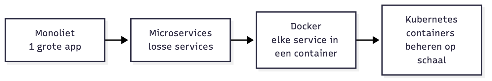
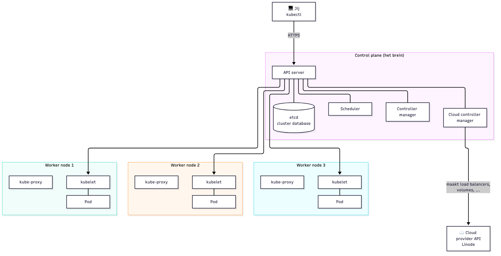
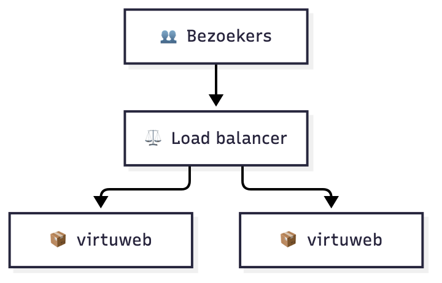
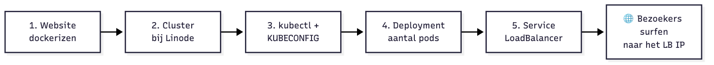
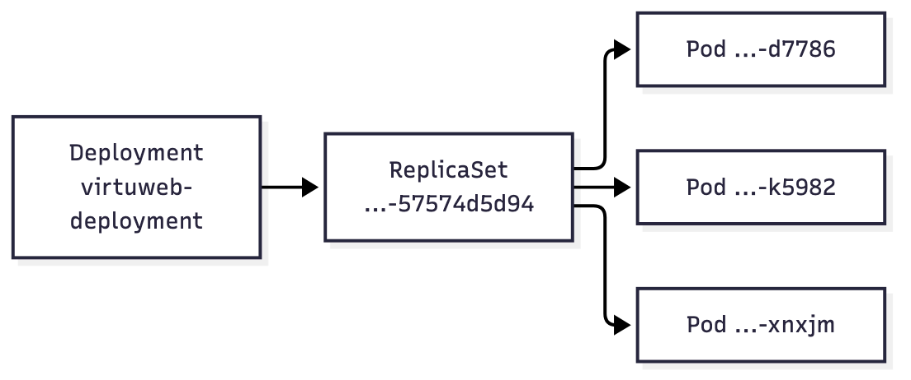
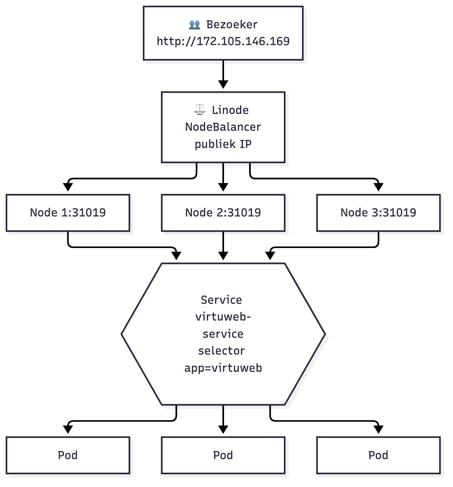
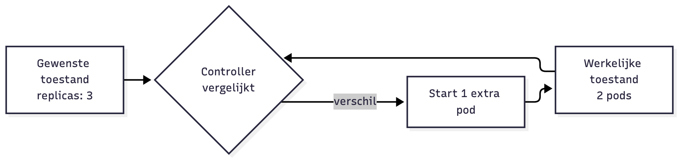
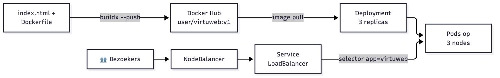

<!-- _class: lead -->

# ☸️ Les 6a — Kubernetes (K8s) Cloud Deployment

Van één container naar een cluster in de cloud

Volledige uitgewerkte notities: [6a-kubernetes-cloud.md](6a-kubernetes-cloud.md)

---

## Les 6 in drie delen

<style scoped>table { font-size: 26px; }</style>

| | Bestand | Wat |
|---|---|---|
| **6a** ← vandaag | `6a-kubernetes-cloud.md` | Website op een **cloud cluster** (Linode) |
| **6b** | `6b-kubernetes-fundamentals.md` | De **bouwstenen**: pods, services, config, opslag |
| **6c** | `6c-kubernetes-minikube.md` | **3-tier app** lokaal op Minikube |

---

## Agenda

1. Waarom container orkestratie?
2. Kubernetes architectuur
3. Demo: snelgroeiende webshop
4. Cluster bij Linode + kubectl
5. Deployment & Service
6. Schalen, self-healing, nieuwe versie
7. Opruimen!

---

## Kubernetes of K8s

> Kubernetes is een open-source systeem om het **deployen, schalen en beheren** van containerapplicaties te automatiseren.

```
Traditioneel → Virtualisatie → Containers → Kubernetes
  1 server       VM's            Docker       Containers op
  1 app          + hypervisor                 een cluster
```

---

## Moderne deployment



- Microservices praten met elkaar via **API's**
- Elke service in een container, mogelijk op **verschillende servers**

---

## Container orkestratie

- Veel gebruikers? → **horizontaal schalen**: meer containers van hetzelfde image
- Meer containers → **load balancer** nodig
- Container down? → wie start hem opnieuw?
- Nieuwe versie? → alles vervangen zonder downtime

**Automatisch onderhoud, deployment, schalen, ...** = <span style="color:#d00">Container Orkestratie</span>

---

## Waarom niet Docker Compose?

| | Compose | Kubernetes |
|---|---|---|
| Machines | 1 host | Cluster |
| Node valt uit | Alles plat | Pods verhuizen |
| Load balancing | Zelf regelen | Ingebouwd (Service) |
| Updates | Stop + start | Rolling update + rollback |

---

## Kubernetes = merknaam, er zijn alternatieven

- **Kubernetes**: Google → CNCF, de standaard
- **Docker Swarm**: ingebouwd in Docker
- **Nomad**: HashiCorp
- **Amazon ECS**: AWS
- **Azure Container Apps / Google Cloud Run**: serverless

Managed Kubernetes: **EKS, AKS, GKE, DOKS, LKE**, ...

---

## Voordelen van K8s

- **Self-healing**: crashte container → nieuwe pod
- **High availability**: node down → pods verhuizen
- **Desired state**: jij zegt *wat*, K8s zorgt *dat*
- **Schalen**: 3 → 30 pods met één regel
- **Rolling updates & rollback**
- **Efficiënt**: scheduler vult nodes met ruimte op

---

<!-- _class: lead -->

## Architectuur

---

<!-- _header: '' -->
<!-- _footer: '' -->



---

## Control plane

| Component | Rol |
|---|---|
| **API server** | Enige toegangspoort, `kubectl` praat hiermee |
| **etcd** | Database met de cluster-toestand |
| **Scheduler** | Kiest de node voor elke pod |
| **Controller manager** | Gewenst ↔ werkelijk vergelijken |
| **Cloud controller manager** | Praat met de cloud (load balancers, ...) |

---

## Worker nodes

- **Worker node**: server waarop pods draaien
- **kubelet**: start/bewaakt containers, praat met control plane
- **kube-proxy**: netwerk naar de pods
- **Pod**: kleinste eenheid in K8s
  - meestal 1 container, kan er meer
  - eigen IP-adres

💡 K8s draait **containerd**, geen Docker meer — maar Docker images werken gewoon.

---

## Opstellingen

- **All-in-one single node** → Minikube (Les 6c)
- **1 control plane + meerdere workers** → **deze les**
- **HA control plane + meerdere workers** → productie

Bij **managed Kubernetes** beheert de provider de control plane.

---

<!-- _class: lead -->

## Demo: snelgroeiende webshop 🛒

---

## Fase 1: website in een container

```dockerfile
FROM nginx:alpine
COPY index.html /usr/share/nginx/html/index.html
```

```bash
docker build -t <user>/virtuweb:v1 .
docker run -p 80:80 <user>/virtuweb:v1
```

Website is bereikbaar! ✅

---

## Fase 2: webshop groeit



Eén webserver kan het niet meer aan en crasht.

Oplossing: tweede container + **load balancer**

zie [MilanVives/nginxloadbalancer](https://github.com/MilanVives/nginxloadbalancer)

---

## Fase 3 & 4: barst uit zijn voegen

- Tientallen containers, meerdere servers, meerdere load balancers
- Site aanpassen = image pushen, **alle** containers stoppen, nieuwe starten, ... op elke server 😩

---

## Betere oplossing → Kubernetes

1. **Manifest** aanmaken
2. Aantal **replicas** opgeven
3. Automatische deployment & load balancing!

---

## Stappenplan

<style scoped>section { font-size: 28px; }</style>



1. **Lokaal**: website dockerizen + pushen (multi-platform!)
2. **Cloud**: cluster aanmaken (Linode)
3. **Lokaal**: `kubectl` installeren (eenmalig)
4. **Lokaal**: kubeconfig downloaden → `KUBECONFIG`
5. **Deployment** manifest (hoeveel pods?)
6. **Service** manifest → load balancer = gateway voor bezoekers

---

## ⚠️ Apple Silicon? Multi-platform bouwen!

Mac M1–M4 bouwt **arm64**, cloud nodes zijn **amd64**
→ `exec format error` / `CrashLoopBackOff`

```bash
docker buildx build --platform linux/amd64,linux/arm64 \
  -t <user>/virtuweb:v1 --push .
```

Gebruik **versietags** (`v1`, `v2`), geen `latest`.

---

## Cloud: Linode (Akamai Cloud)

- cloud.linode.com
- **$100 gratis krediet, 60 dagen** (kredietkaart nodig)
- **Control plane gratis**, je betaalt de nodes

---

## Stap 2: cluster aanmaken

**Kubernetes → Create Cluster**

| Veld | Waarde |
|---|---|
| Label | `virtuweb` |
| Region | Amsterdam / Frankfurt |
| Version | recentste |
| HA control plane | uit |
| Node pool | Shared CPU · **Linode 2 GB** · **3** |

---

## Waar is de master? Wat kost het?

- Control plane = **beheerd door Linode**, je ziet enkel het **API Endpoint**
- 3 × Linode 2 GB = 3 × $12 = **$36/maand**
- NodeBalancer = **$10/maand**
- Per uur aangerekend → een les ≈ enkele centen

---

## Stap 3: kubectl

```bash
brew install kubectl                         # macOS
winget install -e --id Kubernetes.kubectl    # Windows
# Linux: curl -LO https://dl.k8s.io/release/.../kubectl
kubectl version --client
```

---

## KUBECONFIG

Download `virtuweb-kubeconfig.yaml` in Linode

```bash
export KUBECONFIG=$PWD/virtuweb-kubeconfig.yaml   # mac/linux
$env:KUBECONFIG="$PWD\virtuweb-kubeconfig.yaml"   # PowerShell
```

⚠️ Absoluut pad · enkel deze terminal · **admin-token: nooit in Git!**

`kubectl config view` toont de huidige config.

---

## Minikube én cloud cluster tegelijk?

`KUBECONFIG` gezet → `~/.kube/config` (Minikube) wordt **genegeerd**

Beide gebruiken: beide bestanden in de lijst (`:` / Windows `;`)

```bash
export KUBECONFIG=$PWD/virtuweb-kubeconfig.yaml:$HOME/.kube/config
kubectl config get-contexts             # * = actief
kubectl config use-context minikube
kubectl config current-context          # check vóór je iets verwijdert!
```

Eerste bestand in de lijst wint · `unset KUBECONFIG` = terug naar Minikube

---

## Eerste kubectl commando's

```bash
kubectl cluster-info
kubectl get nodes
```

```
NAME                          STATUS   ROLES    AGE
lke39957-64994-6164b07d8f2b   Ready    <none>   36m
lke39957-64994-6164b07ded6e   Ready    <none>   36m
lke39957-64994-6164b07e4d16   Ready    <none>   36m
```

---

## Stap 4: eerste pod

```bash
kubectl run virtuweb --image=<user>/virtuweb:v1 --port=80
kubectl get pods -o wide
kubectl describe pod virtuweb     # Events!
```

De **scheduler** kiest de node.

Maar: één pod, en weg = weg → `kubectl delete pod virtuweb`

---

## Stap 5: Deployment manifest

<style scoped>pre { font-size: 0.78em; }</style>

```yaml
apiVersion: apps/v1
kind: Deployment
metadata:
  name: virtuweb-deployment
spec:
  replicas: 3
  selector:
    matchLabels: { app: virtuweb }
  template:
    metadata:
      labels: { app: virtuweb }
    spec:
      containers:
        - name: virtuweb
          image: <user>/virtuweb:v1
          ports: [{ containerPort: 80 }]
```

---

## Apply!

```bash
kubectl apply -f virtuweb-deployment.yaml
kubectl get pods -o wide
```

```
virtuweb-deployment-57574d5d94-d7786   Running   node-1
virtuweb-deployment-57574d5d94-k5982   Running   node-2
virtuweb-deployment-57574d5d94-xnxjm   Running   node-3
```



---

## Stap 6: Service

```yaml
apiVersion: v1
kind: Service
metadata:
  name: virtuweb-service
spec:
  type: LoadBalancer
  selector:
    app: virtuweb      # ← alle pods met dit label
  ports:
    - port: 80
      targetPort: 80
```

---

## Service uitvoeren

```bash
kubectl apply -f virtuweb-service.yaml
kubectl get svc -w
```

```
NAME               TYPE           EXTERNAL-IP       PORT(S)
virtuweb-service   LoadBalancer   172.105.146.169   80:31019/TCP
```

Wordt ook in de cloud aangemaakt → **NodeBalancers** in Linode

Surf naar `http://<EXTERNAL-IP>` → **Werkt!** 🎉

---

## Wat is er gebeurd?

<style scoped>section { font-size: 26px; }</style>



1. Kubernetes maakt de **Service**
2. Linode maakt een **NodeBalancer** met publiek IP
3. NodeBalancer → nodes op **NodePort** 31019
4. Service → alle pods met `app=virtuweb`

`kubectl describe svc virtuweb-service`
**Endpoints** = de IP's van de pods

---

## Kubernetes = desired state

"Ik wil **altijd** 3 pods van dit image"



---

## Self-healing demonstreren

```bash
kubectl get pods --watch            # terminal 1
kubectl delete pod <pod>            # terminal 2
```

→ nieuwe pod verschijnt meteen: **self-healing**

---

## Schalen: 3 → 10

`replicas: 10` in het manifest, dan:

```bash
kubectl apply -f virtuweb-deployment.yaml
kubectl get pods -o wide
```

of snel: `kubectl scale deployment virtuweb-deployment --replicas=10`
of: `kubectl edit deployment virtuweb-deployment`

**3 servers → 10 containers** · meer nodes = Resize Pool in Linode

---

## Website verandert → nieuwe versie

```bash
docker buildx build --platform linux/amd64,linux/arm64 \
  -t <user>/virtuweb:v2 --push .
```

`image: <user>/virtuweb:v2` in het manifest:

```bash
kubectl apply -f virtuweb-deployment.yaml
kubectl rollout status deployment/virtuweb-deployment
kubectl rollout undo deployment/virtuweb-deployment   # oeps!
```

**Rolling update** → geen downtime. Site aanpassen op **één plaats**.

---

## 🧹 Opruimen — volgorde!

```bash
kubectl delete -f virtuweb-service.yaml      # verwijdert NodeBalancer
kubectl delete -f virtuweb-deployment.yaml
```

Daarna in Linode: **Delete Cluster**

Controleer: **NodeBalancers**, **Volumes**, **Linodes** leeg?
Een vergeten cluster = **$46/maand**

---

## Troubleshooting

| Symptoom | Oorzaak |
|---|---|
| `localhost:8080 refused` | `KUBECONFIG` niet gezet |
| `ImagePullBackOff` | typfout of privé image |
| `exec format error` | arm64-image op amd64 |
| `EXTERNAL-IP <pending>` | even wachten / `describe svc` |
| Endpoints leeg | selector ≠ labels |

---

## Samenvatting



- **Deployment** = wat draait er en hoeveel
- **Service** = hoe bereik je het
- **LoadBalancer** = publiek IP via de cloud
- **Desired state** = Kubernetes houdt het zo

---

## Extra bronnen

- kubernetes.io/docs/tutorials/kubernetes-basics → doorloop de 6 modules
- kubectl cheat sheet
- Volgende: **6b** `6b-kubernetes-fundamentals.md` · **6c** `6c-kubernetes-minikube.md`
