<!-- _class: lead -->

# ☸️ Les 6b — Kubernetes Fundamentals

De bouwstenen achter je deployment

Volledige uitgewerkte notities: [6b-kubernetes-fundamentals.md](6b-kubernetes-fundamentals.md)

---

## Les 6 in drie delen

<style scoped>table { font-size: 26px; }</style>

| | Bestand | Wat |
|---|---|---|
| **6a** | `6a-kubernetes-cloud.md` | Website op een **cloud cluster** (Linode) |
| **6b** ← vandaag | `6b-kubernetes-fundamentals.md` | De **bouwstenen**: pods, services, config, opslag |
| **6c** | `6c-kubernetes-minikube.md` | **3-tier app** lokaal op Minikube |

6a = *hoe* · 6b = *waarom* · 6c = zelf doen

---

## Agenda

1. Wat gebeurt er bij `kubectl apply`?
2. Manifests
3. Pods
4. Deployments & ReplicaSets
5. Services & DNS
6. ConfigMaps & Secrets
7. Labels, namespaces, opslag
8. Alles samen: 3-tier

---

<!-- _class: lead -->

## 1. Wat gebeurt er bij `kubectl apply`?

---

<!-- _header: '' -->
<!-- _footer: '' -->

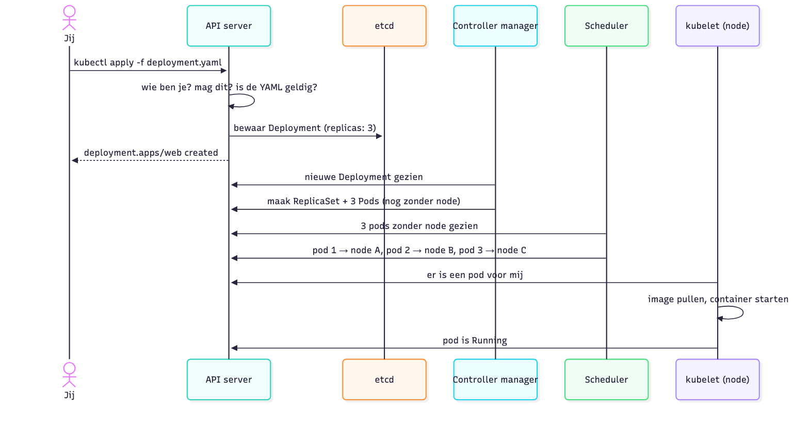

---

## Drie dingen om te onthouden

1. **Alles loopt via de API server**
2. **etcd is het geheugen**: de waarheid over de cluster
3. **Niemand geeft bevelen, iedereen kijkt**: elk onderdeel doet zijn eigen stukje

---

## De controle-lus

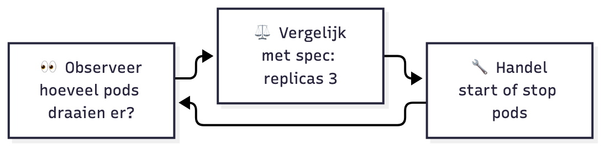

Jij beschrijft de **gewenste toestand** (`spec`)
Kubernetes houdt de **werkelijke toestand** (`status`) in lijn

---

## Imperatief vs declaratief

| Imperatief: "doe dit" | Declaratief: "zo moet het zijn" |
|---|---|
| `kubectl run`, `create`, `scale` | `kubectl apply -f bestand.yaml` |
| Snel om te testen | Herhaalbaar, in Git, reviewbaar |
| Cluster ≠ je bestanden | Bestand = de waarheid |

---

<!-- _class: lead -->

## 2. Manifests

---

## Elk object: vier delen

```yaml
apiVersion: apps/v1        # welke API-versie
kind: Deployment           # welk soort object
metadata:                  # naam, labels, namespace
  name: web
spec:                      # gewenste toestand (jij)
  replicas: 3
# status: ...              # werkelijke toestand (Kubernetes)
```

💡 `kubectl explain deployment.spec` = documentatie in je terminal

---

## De belangrijkste soorten

<style scoped>table { font-size: 26px; }</style>

| `kind` | Wat |
|---|---|
| `Pod` | Eén of meer containers samen |
| `Deployment` | N identieke pods + updates |
| `Service` | Vast adres + load balancing |
| `ConfigMap` / `Secret` | Configuratie / gevoelige config |
| `Namespace` | Map in de cluster |
| `PersistentVolumeClaim` | Aanvraag voor opslag |
| `Ingress` | HTTP-routing van buiten (Les 8) |

---

<!-- _class: lead -->

## 3. Pods

---

## Pod = kleinste eenheid

- Eén of meer containers, **samen** op één node
- **Eén IP-adres**, gedeelde opslag
- Vluchtig: weg = weg

```yaml
kind: Pod
metadata: { name: nginx }
spec:
  containers:
  - { name: nginx, image: nginx:1.27 }
```

Losse pods maak je bijna nooit zelf → **Deployment**

---

## Levenscyclus

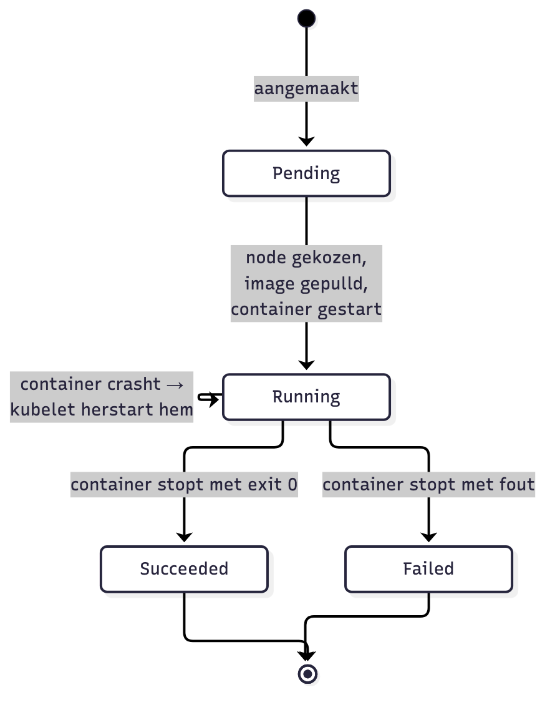

<style scoped>table { font-size: 22px; }</style>

| STATUS | Betekenis |
|---|---|
| `Pending` | Wacht op een node |
| `ContainerCreating` | Image pullen |
| `Running` | Draait |
| `ImagePullBackOff` | Image niet gevonden |
| `CreateContainerConfigError` | Secret/ConfigMap ontbreekt |
| `CrashLoopBackOff` | Crasht steeds opnieuw |

---

## Sidecar: meerdere containers in één pod

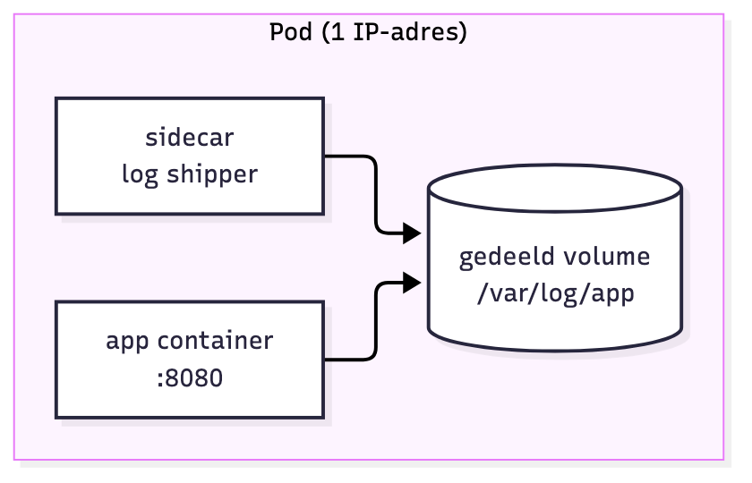

- Hulpcontainer naast de app: logs, proxy, ...
- Delen **netwerk** (`localhost`) en **volumes**
- Frontend + backend? **Niet** in één pod: apart schalen en updaten

---

## Requests en limits

```yaml
resources:
  requests: { cpu: 100m, memory: 128Mi }   # gereserveerd
  limits:   { cpu: 500m, memory: 256Mi }   # maximum
```

- **requests**: de scheduler zoekt een node met zoveel vrij
- **limits** overschreden:
  - CPU → afgeremd
  - geheugen → gestopt (`OOMKilled`)

---

## Health checks: probes

<style scoped>table { font-size: 26px; }</style>

| Probe | Vraag | Faalt? |
|---|---|---|
| **readiness** | Klaar voor verkeer? | Tijdelijk **geen verkeer** |
| **liveness** | Leeft de app nog? | Container **herstart** |
| **startup** | Al opgestart? | Andere probes wachten |

```yaml
readinessProbe:
  httpGet: { path: /health, port: 3000 }
  periodSeconds: 5
```

---

<!-- _class: lead -->

## 4. Deployments & ReplicaSets

---

## Wie doet wat?

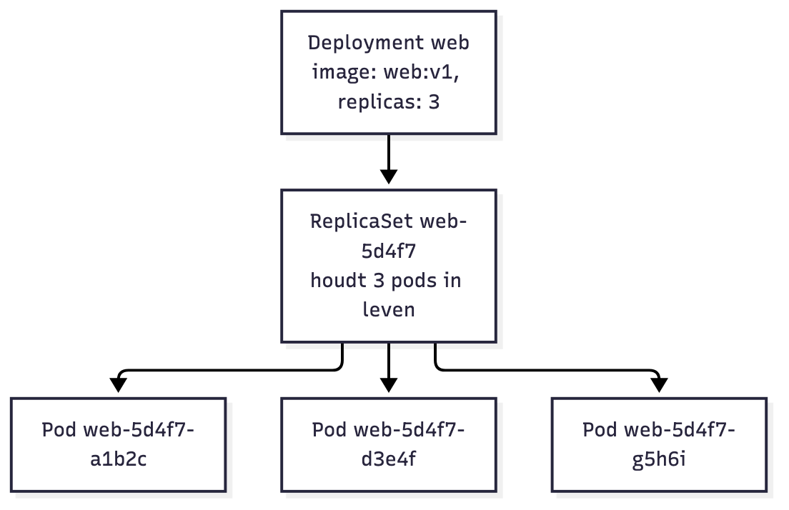

- **ReplicaSet**: precies N pods. Eén weg → één bij.
- **Deployment**: beheert **versies**. Bij een update: nieuwe ReplicaSet, pods schuiven geleidelijk over.

`selector.matchLabels` moet passen bij de **labels** in de template!

---

## Rolling update

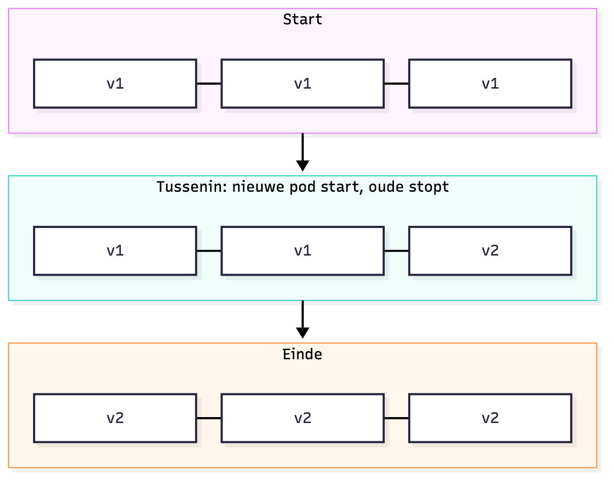

```yaml
strategy:
  rollingUpdate:
    maxSurge: 1
    maxUnavailable: 0
```

Oude ReplicaSet blijft bestaan (0 pods) → **rollback**

```bash
kubectl rollout status  deployment/web
kubectl rollout undo    deployment/web
```

---

<!-- _class: lead -->

## 5. Services & DNS

---

## Probleem: pods zijn vluchtig

Elke nieuwe pod = **nieuw IP-adres**

Oplossing: een **Service** = vaste naam + vast IP + load balancing

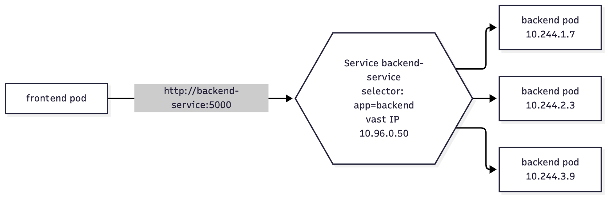

---

## Service types

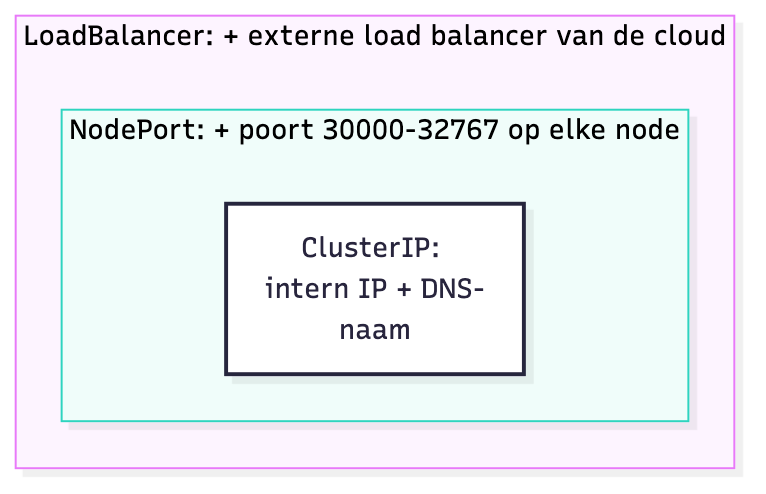

<style scoped>table { font-size: 24px; }</style>

| Type | Bereikbaar van |
|---|---|
| `ClusterIP` | Enkel in de cluster |
| `NodePort` | `<node-IP>:30000-32767` |
| `LoadBalancer` | Publiek IP (cloud) |
| Headless | IP's van de pods zelf |

Elk type bouwt verder op het vorige

---

## DNS: Services vinden via hun naam

```
<service>.<namespace>.svc.cluster.local
backend-service.default.svc.cluster.local
```

| Je zit in... | Je schrijft |
|---|---|
| Zelfde namespace | `http://backend-service:5000` |
| Andere namespace | `http://backend-service.shop:5000` |

`kubectl get endpoints backend-service` → welke pods?

---

<!-- _class: lead -->

## 6. ConfigMaps & Secrets

---

## Configuratie buiten het image

<style scoped>table { font-size: 26px; }</style>

| | ConfigMap | Secret |
|---|---|---|
| Voor | URL's, poorten, log level | Wachtwoorden, tokens, keys |
| In YAML | Leesbaar | base64 of `stringData:` |
| Beveiliging | Geen | Apart beheerd, RBAC |

⚠️ **base64 is geen encryptie!** Echte Secrets niet in Git:
`kubectl create secret generic ... --from-literal=...`

---

## Drie manieren om ze te gebruiken

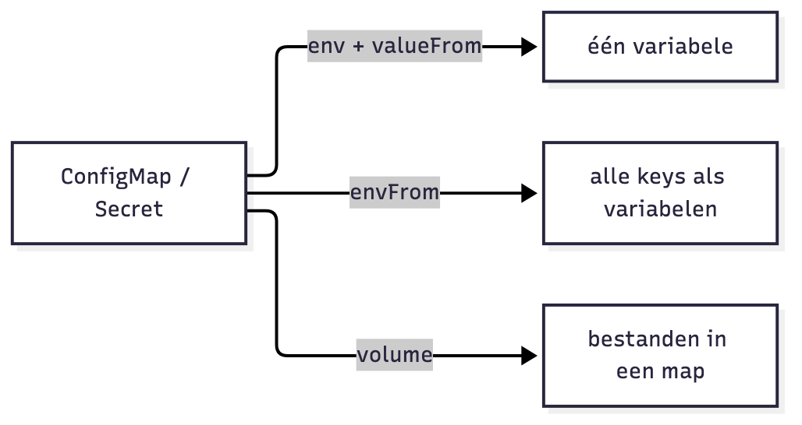

Gewijzigd? Env-variabelen worden enkel bij **start** gelezen
→ `kubectl rollout restart deployment/<naam>`

---

<!-- _class: lead -->

## 7. Labels, namespaces, opslag

---

## Labels & selectors = de lijm

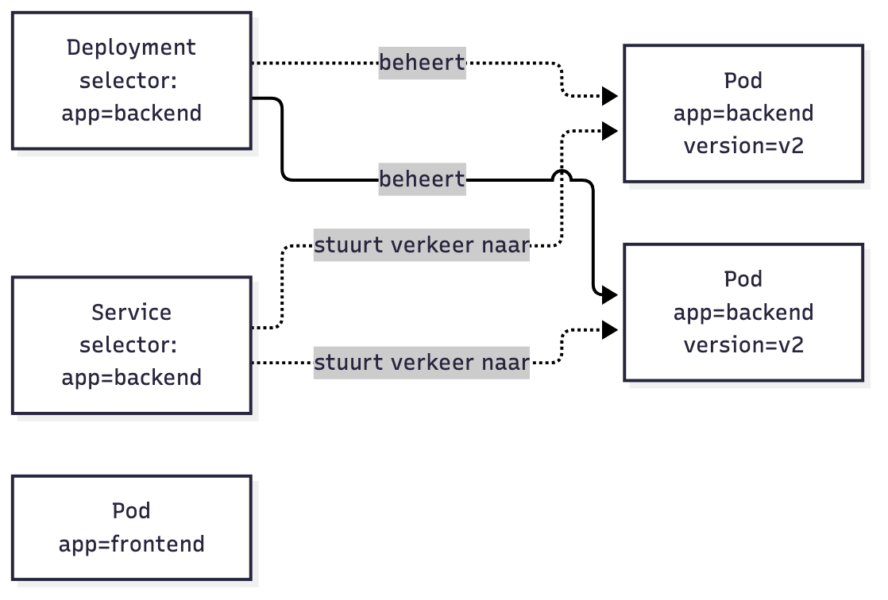

```bash
kubectl get pods --show-labels
kubectl get pods -l app=backend
kubectl get pods -l 'app in (frontend,backend)'
```

Selector ≠ labels → Service **zonder endpoints**

---

## Namespaces

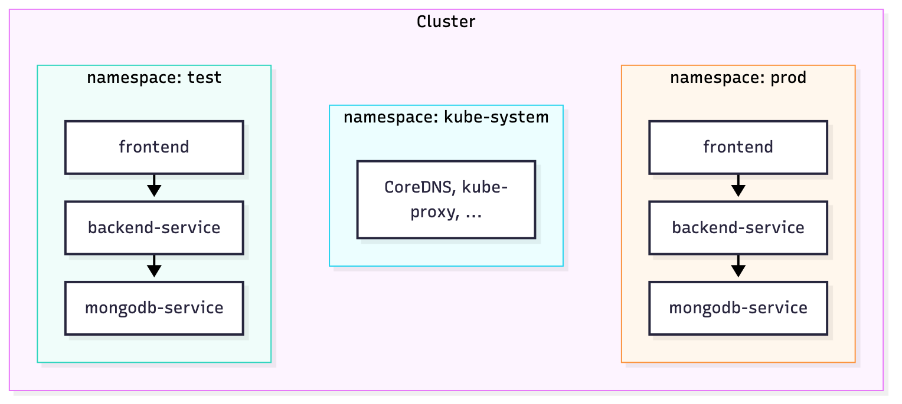

`kubectl apply -f k8s/ -n test` · `kubectl get pods -A`

Scheidt **namen**, niet het **netwerk** (→ NetworkPolicies)

---

## Opslag die een pod overleeft

<style scoped>table { font-size: 24px; }</style>

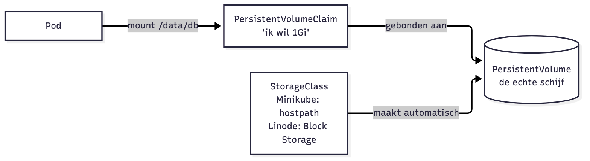

| Volume | Leeft zo lang als |
|---|---|
| `emptyDir` | De pod |
| `persistentVolumeClaim` | Tot je de claim verwijdert |

Meerdere database-replicas → **StatefulSet**

---

<!-- _class: lead -->

## 8. Alles samen

---

## De Pet Shelter in objecten

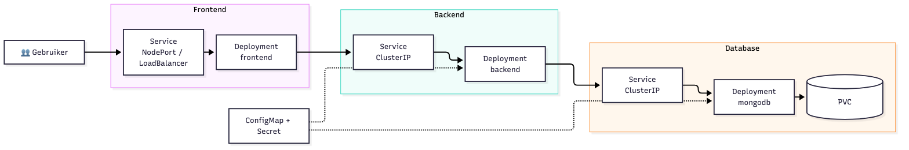

Zelf deployen in **6c**

---

## Het patroon

- **Deployment**: wat draait er?
- **Service**: hoe bereik je het?
- **ConfigMap / Secret**: met welke instellingen?
- **PVC**: welke data blijft?

Enkel wat publiek moet → `NodePort` / `LoadBalancer`
De rest → `ClusterIP`

---

## Best practices

- ✅ Declaratief: manifests in Git, `kubectl apply`
- ✅ Versietags, nooit `latest` in productie
- ✅ Requests en limits op elke container
- ✅ readinessProbe op alles wat verkeer krijgt
- ✅ Secrets niet in Git
- ✅ Consistente labels

---

## Volgende: 6c

**3-tier Pet Shelter** zelf deployen op Minikube

`6c-kubernetes-minikube.md`
