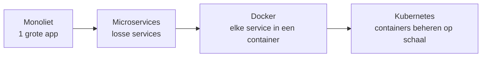
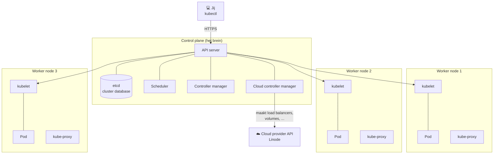
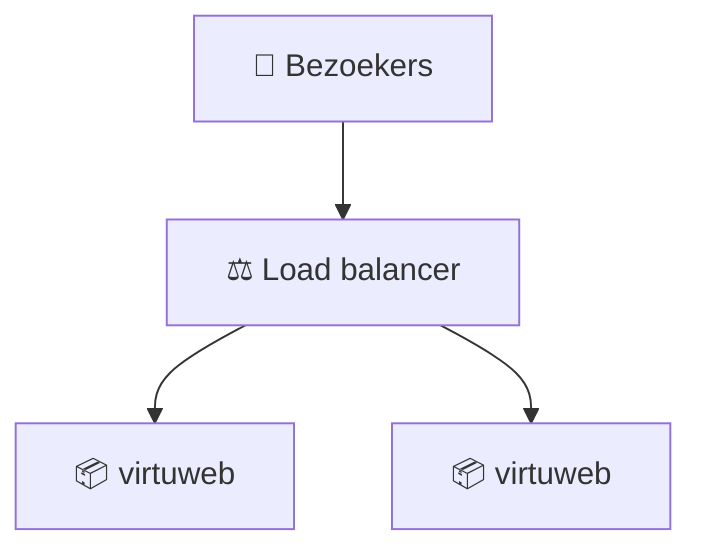
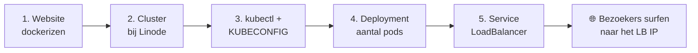
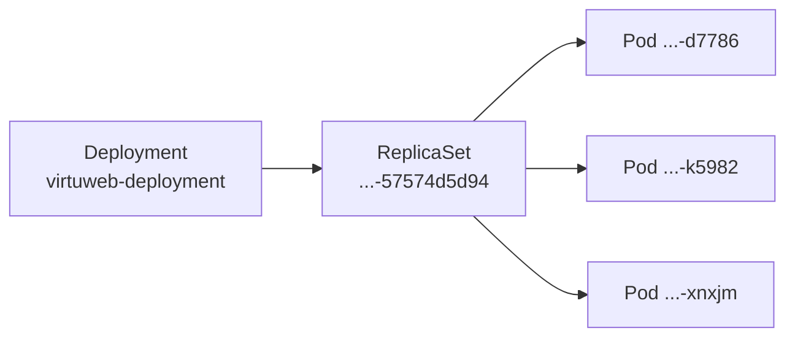
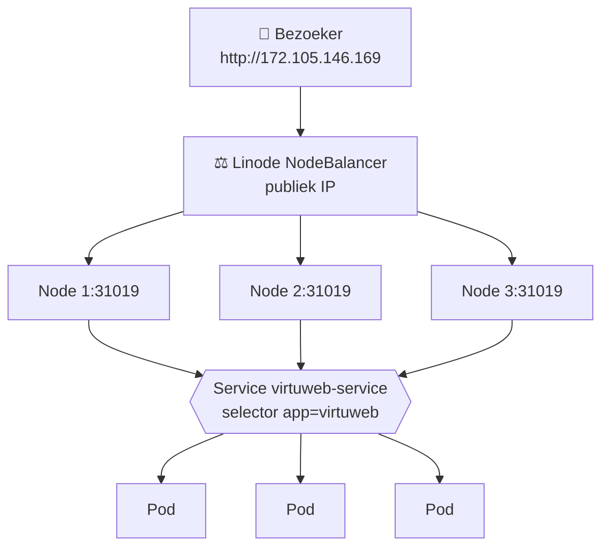
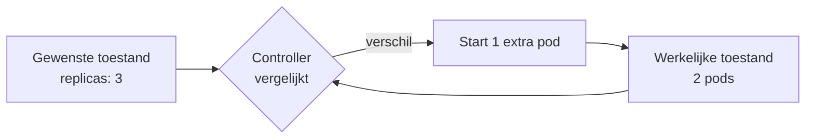
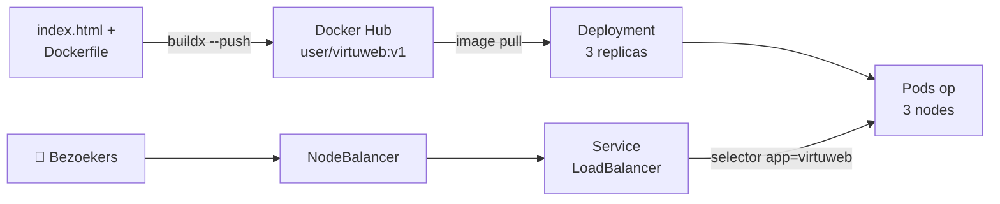

# Les 6a – Kubernetes Cloud Deployment

> Slides voor in de les: [kubernetes-cloud-slides.md](kubernetes-cloud-slides.md) · Demobestanden: [cloud-demo/](cloud-demo/)

## 📋 Inhoud

1. [Waarom Kubernetes?](#1-waarom-kubernetes)
2. [Kubernetes in een notendop](#2-kubernetes-in-een-notendop)
3. [Het verhaal: een snelgroeiende webshop](#3-het-verhaal-een-snelgroeiende-webshop)
4. [Stap 1 – Website dockerizen en pushen](#4-stap-1--website-dockerizen-en-pushen)
5. [Stap 2 – Kubernetes cluster aanmaken bij Linode](#5-stap-2--kubernetes-cluster-aanmaken-bij-linode)
6. [Stap 3 – kubectl en KUBECONFIG](#6-stap-3--kubectl-en-kubeconfig)
7. [Stap 4 – Eerste pod met `kubectl run`](#7-stap-4--eerste-pod-met-kubectl-run)
8. [Stap 5 – Deployment manifest](#8-stap-5--deployment-manifest)
9. [Stap 6 – Service van type LoadBalancer](#9-stap-6--service-van-type-loadbalancer)
10. [Stap 7 – Schalen, self-healing en een nieuwe versie uitrollen](#10-stap-7--schalen-self-healing-en-een-nieuwe-versie-uitrollen)
11. [Stap 8 – Opruimen (en kosten vermijden)](#11-stap-8--opruimen-en-kosten-vermijden)
12. [Troubleshooting](#12-troubleshooting)
13. [Samenvatting & cheatsheet](#13-samenvatting--cheatsheet)

---

## 1. Waarom Kubernetes?

Applicaties evolueren van **monolieten** (één grote, logge applicatie) naar **microservices** (kleine, losse services die via API's met elkaar praten). Elke microservice draait in een container — en al snel heb je er tientallen, verspreid over meerdere servers.



Dan duiken vragen op die Docker alleen niet beantwoordt:

- **Grote toevloed van gebruikers?** → horizontaal schalen: méér containers van hetzelfde image, met een **load balancer** ervoor.
- **Container crasht om 3 uur 's nachts?** → wie start hem opnieuw?
- **Nieuwe versie van de site?** → alle containers één voor één vervangen zonder downtime.
- **Eén server is niet genoeg?** → containers verdelen over meerdere machines.

Dit alles automatisch laten gebeuren heet **container orkestratie**.

### Waarom niet gewoon Docker Compose?

Compose is perfect voor één machine. `docker compose up --scale web=3` kan zelfs meerdere replicas starten. Maar:

| | Docker Compose | Kubernetes |
|---|---|---|
| Aantal machines | Eén host | Cluster van meerdere nodes |
| Container crasht | `restart:` policy, enkel op die host | Pod wordt vervangen, eventueel op een andere node |
| Node valt uit | Alles plat | Pods worden herpland op gezonde nodes |
| Load balancing | Zelf regelen (bv. nginx ervoor) | Ingebouwd via **Services** |
| Updates | Stoppen en herstarten | **Rolling updates** + rollback |
| Configuratie | `docker-compose.yml` | YAML **manifests** (desired state) |

### Andere orkestrators

Kubernetes (K8s) is de de-facto standaard, oorspronkelijk van Google en nu beheerd door de **Cloud Native Computing Foundation (CNCF)**. Er zijn alternatieven:

| Orkestrator | Van |
|---|---|
| **Docker Swarm** | Docker — ingebouwd in Docker Engine, eenvoudig maar weinig gebruikt |
| **Nomad** | HashiCorp — lichtgewicht, ook voor niet-container workloads |
| **Amazon ECS** | AWS — eigen orkestrator van Amazon |
| **Azure Container Apps / Google Cloud Run** | Serverless containers: je ziet geen cluster meer |

> [!NOTE]
> Bijna elke cloudprovider biedt ook **managed Kubernetes** aan: Amazon EKS, Azure AKS, Google GKE, DigitalOcean DOKS, Linode LKE, ... De Kubernetes-kennis die je hier opdoet werkt overal.

### Wat Kubernetes je oplevert

| Voordeel | Betekenis |
|---|---|
| **Self-healing** | Crasht een container, dan start Kubernetes een nieuwe. Valt een node uit, dan verhuizen de pods. |
| **Desired state** | Je beschrijft *wat* je wil ("altijd 3 kopieën"), Kubernetes zorgt *dat* het zo is. |
| **Schalen** | Van 3 naar 30 pods met één commando of één regel in een YAML-bestand. |
| **Load balancing** | Verkeer wordt automatisch verdeeld over alle gezonde pods. |
| **Rolling updates & rollback** | Nieuwe versie zonder downtime; gaat het mis, dan terug naar de vorige versie. |
| **Efficiënt** | De scheduler plaatst pods op nodes die nog ruimte hebben. |

---

## 2. Kubernetes in een notendop


Een Kubernetes **cluster** bestaat uit twee soorten machines:



| Begrip | Betekenis |
|---|---|
| **Control plane** (vroeger "master") | Het brein van de cluster. Beslist wat waar draait. |
| **API server** | De enige toegangspoort tot de cluster. `kubectl` praat hiermee. |
| **etcd** | Database met de volledige toestand van de cluster. |
| **Scheduler** | Bepaalt op welke node een nieuwe pod terechtkomt. |
| **Controller manager** | Vergelijkt continu *gewenste* met *werkelijke* toestand en grijpt in. |
| **Cloud controller manager** | Praat met de cloudprovider, bv. om een echte load balancer aan te maken. |
| **Worker node** | Server waarop je pods draaien. |
| **kubelet** | Agent op elke node: start en bewaakt de containers, rapporteert aan de control plane. |
| **kube-proxy** | Regelt het netwerkverkeer naar pods op elke node. |
| **Pod** | Kleinste eenheid in Kubernetes: één (meestal) of meerdere containers, met een eigen IP-adres. |

> [!TIP]
> **Docker vs Kubernetes:** Kubernetes gebruikt Docker niet meer als runtime (sinds v1.24 draait het met **containerd**). Maar de images die je met `docker build` maakt zijn standaard **OCI-images** en werken gewoon. Docker = images bouwen, Kubernetes = ze draaien op schaal.

### Mogelijke opstellingen

| Opstelling | Gebruik |
|---|---|
| **All-in-one, single node** | Control plane en workload op één machine. Leren en testen → **Minikube** ([Les 6c](kubernetes-minikube.md)). |
| **Eén control plane + meerdere workers** | **Deze les.** Bij managed Kubernetes beheert de provider de control plane voor jou. |
| **High-availability control plane + meerdere workers** | Productie: meerdere control plane nodes, etcd gerepliceerd. Bij LKE een betalende optie. |

---

## 3. Het verhaal: een snelgroeiende webshop

We volgen een webshop – **Virtuweb** – die groeit.

**Fase 1 – Eén container.** De site zit in een image op Docker Hub. Op een server: `docker run -d -p 80:80 <user>/virtuweb`. Werkt!

**Fase 2 – Meer bezoekers.** Eén container kan het niet meer aan. Oplossing: een tweede container plus een load balancer ervoor (zie [nginxloadbalancer](https://github.com/MilanVives/nginxloadbalancer)).



**Fase 3 – De webshop barst uit zijn voegen.** Tientallen containers verspreid over meerdere servers, elk met hun eigen load balancer. Wie houdt dat bij?

**Fase 4 – De site verandert.** Nieuw image pushen, *alle* containers stoppen, nieuwe opstarten, hopen dat niets misgaat... op elke server opnieuw.

**De betere oplossing: Kubernetes.**

1. Eén **manifest** beschrijft het image en het aantal kopieën.
2. Kubernetes verdeelt de pods automatisch over de nodes.
3. Eén **Service** zorgt voor load balancing en een publiek IP-adres.
4. Een nieuwe versie = één regel aanpassen.

### Het stappenplan



---

## 4. Stap 1 – Website dockerizen en pushen

Alle bestanden staan in [cloud-demo/](cloud-demo/).

**index.html**

```html
<h1>Snelgroeiende Virtualisatie-webshop</h1>
<ul>
  <li>Docker cursus</li>
</ul>
```

**Dockerfile**

```dockerfile
FROM nginx:alpine
COPY index.html /usr/share/nginx/html/index.html
```

Lokaal testen:

```bash
docker build -t <user>/virtuweb:v1 .
docker run --rm -p 8080:80 <user>/virtuweb:v1
# surf naar http://localhost:8080
```

### Pushen naar Docker Hub – multi-platform!

> [!WARNING]
> **Werk je op een Mac met Apple Silicon (M1–M4)?** Dan bouwt `docker build` standaard een **arm64**-image. De nodes van Linode (en de meeste cloudproviders) zijn **amd64**. Resultaat: je pods crashen met `exec format error` en blijven in `CrashLoopBackOff`.
>
> Bouw daarom altijd voor beide architecturen (zie [Dockerfile Multiplatform](../02-Dockerfile/Dockerfile-Multiplatform.md)):

```bash
docker login
docker buildx build --platform linux/amd64,linux/arm64 \
  -t <user>/virtuweb:v1 --push .
```

Controleer op Docker Hub (tab **Tags**) dat je image zowel `linux/amd64` als `linux/arm64` vermeldt, of via de CLI:

```bash
docker buildx imagetools inspect <user>/virtuweb:v1
```

> [!TIP]
> Gebruik **versietags** (`v1`, `v2`, ...) in plaats van `latest`. Zo weet je altijd welke versie er in de cluster draait, en kan je terugrollen.

---

## 5. Stap 2 – Kubernetes cluster aanmaken bij Linode

We gebruiken **Linode Kubernetes Engine (LKE)** van Akamai Cloud (vroeger gewoon "Linode"):

- Nieuwe accounts krijgen **$100 gratis krediet, 60 dagen geldig**. Een kredietkaart is wel nodig.
- De **control plane is gratis**: je betaalt enkel de worker nodes, load balancers en volumes.
- Eenvoudige interface, cluster binnen enkele minuten klaar.

### Via de Cloud Manager

1. Ga naar [cloud.linode.com](https://cloud.linode.com) → **Kubernetes** → **Create Cluster**.
2. Vul in:

| Veld | Waarde |
|---|---|
| **Cluster label** | `virtuweb` |
| **Region** | Amsterdam (NL) of Frankfurt (DE) — dicht bij je bezoekers |
| **Kubernetes version** | De recentste die wordt aangeboden |
| **HA control plane** | Uit (kost extra, niet nodig om te leren) |
| **Node pool** | Tab **Shared CPU** → **Linode 2 GB** → aantal **3** → **Add** |

3. Controleer de **Cluster Summary** rechts en klik **Create Cluster**.

Na enkele minuten zie je 3 nodes met status **Running**. Dit zijn je **worker nodes**: gewone Linodes (VM's) die ook onder **Linodes** in het menu verschijnen.

> [!NOTE]
> **Waar is de control plane?** Die zie je niet als machine: Linode beheert ze voor jou. Je ziet enkel het **Kubernetes API Endpoint** (`https://....linodelke.net:443`). Dat is de API server waarmee `kubectl` straks praat.

### Wat kost dit?

| Onderdeel | Prijs (okt 2026) |
|---|---|
| Control plane | Gratis |
| Linode 2 GB (1 CPU, 2 GB RAM) | $12/maand per node (≈ $0,018/uur) |
| 3 worker nodes | $36/maand |
| NodeBalancer (load balancer, zie stap 6) | $10/maand |

Er wordt **per uur** aangerekend. Een cluster een middag laten draaien kost een paar dollarcent. Een cluster vergeten kost $46 per maand. → zie [Opruimen](#11-stap-8--opruimen-en-kosten-vermijden).

<details>
<summary>Alternatief: cluster aanmaken via de Linode CLI</summary>

```bash
pip install linode-cli    # of: brew install linode-cli
linode-cli configure      # log in via de browser

# Beschikbare versies opvragen
linode-cli lke versions-list

# Cluster aanmaken: 3 x Linode 2GB (type g6-standard-1) in Amsterdam
linode-cli lke cluster-create \
  --label virtuweb \
  --region nl-ams \
  --k8s_version <versie> \
  --node_pools.type g6-standard-1 \
  --node_pools.count 3
```

In [Les 5 – IaC](../05-IaC/iac.md) zie je hoe je dit met **Terraform/OpenTofu** declaratief doet (resource `linode_lke_cluster`).

</details>

---

## 6. Stap 3 – kubectl en KUBECONFIG

### kubectl installeren (eenmalig)

`kubectl` is de command-line tool om met de API server te praten — multiplatform.

| OS | Installatie |
|---|---|
| macOS | `brew install kubectl` |
| Windows | `winget install -e --id Kubernetes.kubectl` |
| Linux | zie hieronder |

```bash
# Linux (amd64)
curl -LO "https://dl.k8s.io/release/$(curl -L -s https://dl.k8s.io/release/stable.txt)/bin/linux/amd64/kubectl"
chmod +x kubectl
sudo mv kubectl /usr/local/bin/kubectl

kubectl version --client
```

> [!TIP]
> Heb je **Docker Desktop**? Dan zit `kubectl` er vaak al bij.

### KUBECONFIG: welke cluster?

`kubectl` moet weten **met welke cluster** het praat en **wie jij bent**. Dat staat in een **kubeconfig**-bestand.

Op de pagina van je cluster in Linode staat onder **Kubeconfig** het bestand `virtuweb-kubeconfig.yaml`: download het, of klik op het `<>`-icoon om de inhoud te kopiëren naar een lokaal bestand.

```yaml
apiVersion: v1
kind: Config
clusters:
  - cluster:
      certificate-authority-data: LS0tLS1CRUdJTi...
      server: https://1789a0cf-....eu-central-2.linodelke.net:443   # ← API server
    name: lke39957
users:
  - name: lke39957-admin
    user:
      token: eyJhbGciOiJSUzI1NiIs...                              # ← jouw toegangssleutel
contexts:
  - context:
      cluster: lke39957
      namespace: default
      user: lke39957-admin
    name: lke39957-ctx
current-context: lke39957-ctx
```

Vertel `kubectl` welk bestand hij moet gebruiken via de omgevingsvariabele `KUBECONFIG`:

```bash
# macOS / Linux / WSL
export KUBECONFIG=$PWD/virtuweb-kubeconfig.yaml
```

```powershell
# Windows PowerShell
$env:KUBECONFIG="$PWD\virtuweb-kubeconfig.yaml"
```

> [!WARNING]
> - Gebruik een **absoluut pad** (vandaar `$PWD`). Met een relatief pad werkt `kubectl` niet meer zodra je van map wisselt.
> - `export` geldt enkel voor **deze terminal**. Nieuwe terminal = opnieuw instellen.
> - De kubeconfig bevat een **admin-token**: wie het bestand heeft, beheert je cluster. **Nooit committen naar Git** (de [`.gitignore`](cloud-demo/.gitignore) in `cloud-demo/` sluit het uit).

### Minikube én cloud cluster tegelijk?

Zonder `KUBECONFIG` kijkt `kubectl` in `~/.kube/config`. Daar schrijft ook Minikube zijn config.

> [!IMPORTANT]
> Is `KUBECONFIG` gezet, dan **negeert** `kubectl` `~/.kube/config` volledig. De variabele **vervangt** het standaardbestand, ze vult het niet aan. Je Minikube cluster is dan onzichtbaar tot je `unset KUBECONFIG` doet (of een nieuwe terminal opent).

Wil je beide clusters gebruiken, zet dan **beide bestanden** in `KUBECONFIG` (gescheiden door `:`, op Windows `;`). `kubectl` voegt ze samen en je wisselt met **contexts**:

```bash
export KUBECONFIG=$PWD/virtuweb-kubeconfig.yaml:$HOME/.kube/config

kubectl config get-contexts              # * = actieve context
kubectl config use-context minikube      # naar je lokale cluster
kubectl config use-context lke39957-ctx  # terug naar Linode
kubectl config current-context           # waar praat ik nu mee?
```

| Regel | Gevolg |
|---|---|
| Het **eerste** bestand in de lijst wint bij conflicten | Ook `current-context`: de volgorde bepaalt welke cluster standaard actief is |
| `use-context` schrijft naar het **eerste** bestand | Dat bestand wordt aangepast |
| `--kubeconfig <file>` als optie | Overschrijft `KUBECONFIG` en `~/.kube/config`, voor dat ene commando |

> [!TIP]
> Twijfel je? Eerst `kubectl config current-context` vóór je iets verwijdert. Zo voorkom je dat je per ongeluk je cloud cluster leegmaakt in plaats van Minikube. Meer info: [Organizing cluster access](https://kubernetes.io/docs/concepts/configuration/organize-cluster-access-kubeconfig/).

### Verbinding testen

```bash
kubectl config view          # welke config gebruik ik? (tokens worden verborgen)
kubectl cluster-info
kubectl get nodes
```

```
NAME                            STATUS   ROLES    AGE   VERSION
lke39957-64994-6164b07d8f2b     Ready    <none>   36m   v1.33.x
lke39957-64994-6164b07ded6e     Ready    <none>   36m   v1.33.x
lke39957-64994-6164b07e4d16     Ready    <none>   36m   v1.33.x
```

Drie worker nodes, geen control plane: die beheert Linode.

---

## 7. Stap 4 – Eerste pod met `kubectl run`

De nodes zijn nog leeg. Net zoals `docker run` één container start, start `kubectl run` één **pod**:

```bash
kubectl run virtuweb --image=<user>/virtuweb:v1 --port=80
kubectl get pods
```

```
NAME       READY   STATUS    RESTARTS   AGE
virtuweb   1/1     Running   0          2m15s
```

De **scheduler** heeft bepaald op welke node deze pod draait. Kijk in de pod:

```bash
kubectl get pods -o wide        # op welke node? welk IP?
kubectl describe pod virtuweb   # details + Events onderaan
```

```
Events:
  Type    Reason     Age    From               Message
  ----    ------     ----   ----               -------
  Normal  Scheduled  6m50s  default-scheduler  Successfully assigned default/virtuweb to lke39957-...
  Normal  Pulling    6m50s  kubelet            Pulling image "<user>/virtuweb:v1"
  Normal  Pulled     6m44s  kubelet            Successfully pulled image ...
  Normal  Created    6m44s  kubelet            Created container virtuweb
  Normal  Started    6m44s  kubelet            Started container virtuweb
```

Hier zie je de hele keten: scheduler → kubelet → image pullen → container starten.

**Maar:** we willen meerdere kopieën, en als deze pod sterft komt hij niet terug. Probeer maar:

```bash
kubectl delete pod virtuweb
kubectl get pods     # weg is weg
```

Een losse pod is als een losse `docker run`. We willen een **gestructureerde, declaratieve** aanpak → een **Deployment**.

---

## 8. Stap 5 – Deployment manifest

Een **Deployment** beschrijft de **gewenste toestand**: welk image, hoeveel kopieën (**replicas**), welke labels.

**[virtuweb-deployment.yaml](cloud-demo/virtuweb-deployment.yaml)**

```yaml
apiVersion: apps/v1
kind: Deployment
metadata:
  name: virtuweb-deployment
  labels:
    app: virtuweb
spec:
  replicas: 3                     # desired state: altijd 3 pods
  selector:
    matchLabels:
      app: virtuweb               # deze Deployment beheert pods met dit label
  template:                       # sjabloon voor elke pod
    metadata:
      labels:
        app: virtuweb
    spec:
      containers:
        - name: virtuweb
          image: <user>/virtuweb:v1
          ports:
            - containerPort: 80
```

| Veld | Betekenis |
|---|---|
| `replicas` | Hoeveel pods er altijd moeten draaien |
| `selector.matchLabels` | Welke pods "van deze Deployment" zijn |
| `template` | Het sjabloon voor elke pod. De labels hier **moeten** overeenkomen met de selector. |
| `containers.image` | Het image van Docker Hub |
| `containerPort` | Poort waarop de container luistert (documentatie, opent niets) |

```bash
kubectl apply -f virtuweb-deployment.yaml
kubectl get deployments
kubectl get pods -o wide
```

```
NAME                                   READY   STATUS    RESTARTS   AGE   IP         NODE
virtuweb-deployment-57574d5d94-d7786   1/1     Running   0          70s   10.2.1.3   lke39957-...-d8f2b
virtuweb-deployment-57574d5d94-k5982   1/1     Running   0          70s   10.2.2.6   lke39957-...-ded6e
virtuweb-deployment-57574d5d94-xnxjm   1/1     Running   0          70s   10.2.0.8   lke39957-...-e4d16
```

De scheduler verdeelt de pods over de nodes. Elke pod heeft een **eigen IP**, maar dat is enkel bereikbaar **binnen** de cluster.

> [!NOTE]
> **Waarom die rare namen?** Een Deployment maakt een **ReplicaSet** (`virtuweb-deployment-57574d5d94`), en die maakt de pods (`...-d7786`). De ReplicaSet zorgt dat het aantal pods klopt; de Deployment beheert de versies van de ReplicaSets (voor updates en rollback).



---

## 9. Stap 6 – Service van type LoadBalancer

De pods draaien, maar hoe bereikt een bezoeker ze? Pods komen en gaan, en hun IP's veranderen. We hebben een **vast aanspreekpunt** nodig dat verkeer verdeelt: een **Service**.

**[virtuweb-service.yaml](cloud-demo/virtuweb-service.yaml)**

```yaml
apiVersion: v1
kind: Service
metadata:
  name: virtuweb-service
spec:
  type: LoadBalancer              # Linode maakt hiervoor een NodeBalancer aan
  selector:
    app: virtuweb                 # verkeer gaat naar alle pods met dit label
  ports:
    - name: http
      port: 80                    # poort op de load balancer
      targetPort: 80              # poort in de container
```

De **selector** is de lijm: alle pods met label `app: virtuweb` worden gebalanceerd, ongeacht hoeveel het er zijn.

```bash
kubectl apply -f virtuweb-service.yaml
kubectl get service virtuweb-service --watch     # wacht tot EXTERNAL-IP ingevuld is, Ctrl+C
```

```
NAME               TYPE           CLUSTER-IP       EXTERNAL-IP       PORT(S)        AGE
virtuweb-service   LoadBalancer   10.128.165.193   172.105.146.169   80:31019/TCP   45s
```

Surf naar `http://<EXTERNAL-IP>` → **Werkt!** 🎉

### Wat is er net gebeurd?



1. Kubernetes maakte een **Service** aan in de cluster.
2. De **cloud controller manager** zag `type: LoadBalancer` en vroeg Linode om een echte load balancer: een **NodeBalancer**. Je ziet hem in de Cloud Manager onder **NodeBalancers**, met als naam `ccm-...`.
3. De NodeBalancer stuurt verkeer naar de nodes (op een **NodePort**, hier `31019`), en de Service verdeelt het over de pods.

```bash
kubectl describe service virtuweb-service
```

```
Selector:                 app=virtuweb
Type:                     LoadBalancer
LoadBalancer Ingress:     172.105.146.169
Port:                     http  80/TCP
TargetPort:               80/TCP
NodePort:                 http  31019/TCP
Endpoints:                10.2.1.3:80,10.2.2.6:80,10.2.0.8:80
```

**Endpoints** = de IP's van de pods achter deze Service. Staat hier niets? Dan klopt je selector niet met de labels van je pods.

### Service types in het kort

| Type | Bereikbaar van | Typisch gebruik |
|---|---|---|
| `ClusterIP` (default) | Enkel binnen de cluster | Databases, interne API's |
| `NodePort` | `<NodeIP>:30000–32767` | Testen, Minikube ([Les 6c](kubernetes-minikube.md)) |
| `LoadBalancer` | Publiek IP via de cloudprovider | Je site op internet zetten (deze les) |

> [!TIP]
> Elke `LoadBalancer`-service = één NodeBalancer = $10/maand. Bij meerdere sites gebruik je later één **Ingress controller** achter één load balancer: zie [Les 8](../08-Ingress-and-Reverse-Proxies/).

---

## 10. Stap 7 – Schalen, self-healing en een nieuwe versie uitrollen

### Kubernetes = desired state

Je zegt niet *"start 3 containers"*, maar *"er moeten er altijd 3 zijn"*. De controller manager vergelijkt continu wat je wil met wat er is, en grijpt in.



### Self-healing demonstreren

```bash
# Terminal 1: live meekijken
kubectl get pods --watch

# Terminal 2: een pod "laten crashen"
kubectl delete pod <naam-van-een-pod>
```

De pod wordt `Terminating` en meteen verschijnt er een nieuwe. De site blijft bereikbaar: de Service stuurt enkel verkeer naar gezonde pods.

### Schalen: van 3 naar 10

Declaratief, de aanbevolen manier: pas het manifest aan (`replicas: 10`) en apply opnieuw:

```bash
kubectl apply -f virtuweb-deployment.yaml
kubectl get pods -o wide        # 10 pods verdeeld over 3 nodes
```

Andere manieren (handig om snel te testen, maar je YAML-bestand loopt dan achter op de cluster):

```bash
kubectl scale deployment virtuweb-deployment --replicas=10
kubectl edit deployment virtuweb-deployment      # opent de live YAML in je editor (vim)
```

> [!NOTE]
> **3 servers, 10 containers.** Pods zijn niet hetzelfde als nodes. Kubernetes plant zoveel pods op een node als er plaats is. Meer **nodes** voeg je toe in Linode (**Resize Pool** of **Autoscale Pool**). Meer **pods** regel je met `replicas`.

### De website verandert: een nieuwe versie uitrollen

1. Pas `index.html` aan (bv. een `<li>Dockerfile cursus</li>` erbij).
2. Bouw en push **met een nieuwe tag**:

```bash
docker buildx build --platform linux/amd64,linux/arm64 \
  -t <user>/virtuweb:v2 --push .
```

3. Pas in `virtuweb-deployment.yaml` het image aan naar `:v2` en apply:

```bash
kubectl apply -f virtuweb-deployment.yaml
kubectl rollout status deployment/virtuweb-deployment
```

Kubernetes doet een **rolling update**: telkens een paar nieuwe pods starten, oude afbreken, tot alles op v2 draait. Geen downtime. Ververs je browser een paar keer tijdens de update: je ziet beide versies door elkaar.

```
Begin:     [v1] [v1] [v1]
           [v1] [v1] [v1] [v2]      ← nieuwe pod start
           [v1] [v1] [v2]           ← oude pod stopt
           [v1] [v2] [v2]
Einde:     [v2] [v2] [v2]
```

**Iets misgegaan?** Terug naar de vorige versie:

```bash
kubectl rollout history deployment/virtuweb-deployment
kubectl rollout undo deployment/virtuweb-deployment
```

> [!TIP]
> Snelle variant zonder YAML te openen: `kubectl set image deployment/virtuweb-deployment virtuweb=<user>/virtuweb:v2`. Zelfde rolling update, maar je manifest is niet meer up-to-date.

> [!WARNING]
> **Waarom niet gewoon `:latest` opnieuw pushen?** Dan verandert er niets in het manifest, dus Kubernetes ziet geen reden om iets te doen. Je zou de pods moeten herstarten (`kubectl rollout restart`), je ziet niet welke versie er draait en terugrollen naar "de vorige `latest`" kan niet. Met tags is elke versie expliciet.

---

## 11. Stap 8 – Opruimen (en kosten vermijden)

> [!CAUTION]
> Een **NodeBalancer wordt niet automatisch verwijderd** als je enkel de cluster verwijdert. Ook **Volumes** (persistente opslag) blijven bestaan. Ze blijven gewoon doorrekenen.

De juiste volgorde:

```bash
# 1. Eerst de Kubernetes resources verwijderen.
#    Het verwijderen van de LoadBalancer-service ruimt ook de NodeBalancer op.
kubectl delete -f virtuweb-service.yaml
kubectl delete -f virtuweb-deployment.yaml
kubectl get all
```

2. In de Cloud Manager: **Kubernetes** → `virtuweb` → **Delete Cluster**.
3. Controleer daarna in het menu:
   - **NodeBalancers** → leeg? Zo niet: `...` → **Delete**.
   - **Volumes** → leeg?
   - **Linodes** → geen `lke...`-nodes meer?

> [!TIP]
> Kijk af en toe bij **Billing** naar je *uninvoiced balance*. Zo zie je meteen of er nog iets draait.

---

## 12. Troubleshooting

| Symptoom | Oorzaak | Oplossing |
|---|---|---|
| `kubectl` geeft `connection refused ... localhost:8080` | `KUBECONFIG` niet gezet (nieuwe terminal?) | `export KUBECONFIG=$PWD/virtuweb-kubeconfig.yaml` |
| `Unable to connect to the server` / certificaatfout | Oude kubeconfig van een verwijderde cluster | Nieuwe kubeconfig downloaden |
| Pod `ErrImagePull` / `ImagePullBackOff` | Typfout in imagenaam/tag, of image is privé | `kubectl describe pod <pod>` → Events; image publiek maken op Docker Hub |
| Pod `CrashLoopBackOff`, logs tonen `exec format error` | arm64-image op amd64-nodes (Apple Silicon) | Opnieuw bouwen met `buildx --platform linux/amd64,linux/arm64` |
| `EXTERNAL-IP` blijft `<pending>` | NodeBalancer wordt nog aangemaakt, of quota/account-probleem | 1-2 min wachten; `kubectl describe svc virtuweb-service` → Events |
| Site niet bereikbaar, maar `EXTERNAL-IP` is er | Selector komt niet overeen met pod-labels | `kubectl get endpoints virtuweb-service` → leeg? labels nakijken |
| Pods blijven `Pending` | Te weinig CPU/geheugen op de nodes | `kubectl describe pod` → Events; nodes bijzetten |

Handige debug-commando's:

```bash
kubectl get pods -o wide
kubectl describe pod <pod>          # Events onderaan!
kubectl logs <pod>
kubectl logs -l app=virtuweb        # logs van alle virtuweb pods
kubectl get events --sort-by=.metadata.creationTimestamp
kubectl get endpoints virtuweb-service
```

---

## 13. Samenvatting & cheatsheet



| Commando | Doel |
|---|---|
| `export KUBECONFIG=$PWD/<file>.yaml` | kubectl naar de juiste cluster laten wijzen |
| `kubectl get nodes` | Verbinding testen, nodes bekijken |
| `kubectl run <naam> --image=` | Losse pod starten (enkel om te testen) |
| `kubectl apply -f <file>.yaml` | Manifest toepassen (aanmaken of bijwerken) |
| `kubectl get pods -o wide` | Pods + node + IP |
| `kubectl describe <type> <naam>` | Details en Events |
| `kubectl logs <pod>` | Logs van een pod |
| `kubectl get svc` | Services + EXTERNAL-IP |
| `kubectl scale deployment <naam> --replicas=N` | Snel schalen |
| `kubectl rollout status/history/undo deployment/<naam>` | Updates opvolgen en terugdraaien |
| `kubectl delete -f <file>.yaml` | Resources verwijderen |

**Wat je nu kan:**

- ✅ Uitleggen waarom container orkestratie nodig is en wat Kubernetes oplost
- ✅ De onderdelen van een cluster benoemen (control plane, nodes, kubelet, kube-proxy, pods)
- ✅ Een multi-platform image bouwen en pushen
- ✅ Een managed Kubernetes cluster aanmaken bij Linode
- ✅ `kubectl` verbinden via een kubeconfig
- ✅ Een Deployment en een LoadBalancer Service schrijven en toepassen
- ✅ Schalen, self-healing demonstreren, een rolling update en rollback uitvoeren
- ✅ Alles correct opruimen zonder verborgen kosten

### Volgende stappen

- **[Les 6b – Kubernetes Fundamentals](kubernetes-fundamentals.md):** de theorie achter pods, services, deployments, ConfigMaps, Secrets, namespaces en labels.
- **[Les 6c – Kubernetes met Minikube](kubernetes-minikube.md):** een 3-tier applicatie (frontend, backend, database) lokaal deployen.

### Extra bronnen

- [Kubernetes Basics tutorial](https://kubernetes.io/docs/tutorials/kubernetes-basics/): doorloop de 6 modules
- [kubectl Cheat Sheet](https://kubernetes.io/docs/reference/kubectl/cheatsheet/)
- [LKE documentatie](https://techdocs.akamai.com/cloud-computing/docs/linode-kubernetes-engine)
- [Linode pricing](https://www.linode.com/pricing/)
