# Les 6b – Kubernetes Fundamentals

> In [Les 6a](kubernetes-cloud-start.md) deployden we een website op een cloud cluster: *hoe* doe je het. Hier kijken we naar het *waarom*: welke bouwstenen zijn er, en hoe werken ze samen? In [Les 6c](kubernetes-minikube.md) pas je alles toe op een 3-tier applicatie.

## 📋 Inhoud

1. [Wat gebeurt er bij `kubectl apply`?](#1-wat-gebeurt-er-bij-kubectl-apply)
2. [De anatomie van een manifest](#2-de-anatomie-van-een-manifest)
3. [Pods](#3-pods)
4. [Deployments en ReplicaSets](#4-deployments-en-replicasets)
5. [Services en DNS](#5-services-en-dns)
6. [ConfigMaps en Secrets](#6-configmaps-en-secrets)
7. [Labels en selectors](#7-labels-en-selectors)
8. [Namespaces](#8-namespaces)
9. [Opslag: volumes en PersistentVolumeClaims](#9-opslag-volumes-en-persistentvolumeclaims)
10. [Alles samen: een 3-tier applicatie](#10-alles-samen-een-3-tier-applicatie)
11. [Samenvatting](#11-samenvatting)

---

## 1. Wat gebeurt er bij `kubectl apply`?

De onderdelen van een cluster (API server, etcd, scheduler, controller manager, kubelet, kube-proxy) zag je al in [Les 6a](kubernetes-cloud-start.md#2-kubernetes-in-een-notendop). Interessanter is hoe ze samenwerken. Dit gebeurt er als je een Deployment met 3 replicas toepast:

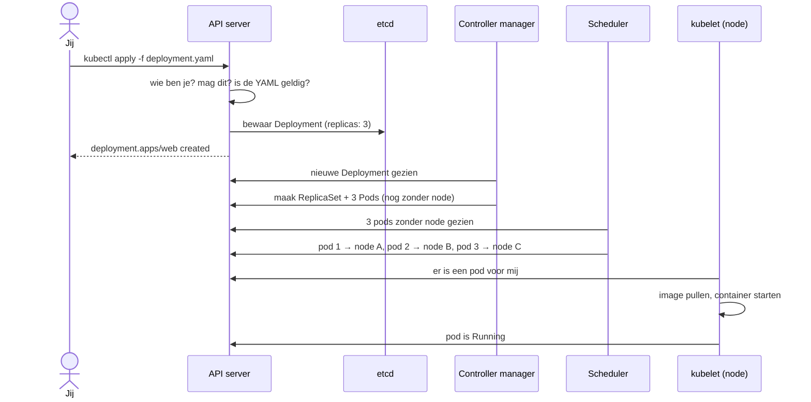

Drie dingen om te onthouden:

1. **Alles loopt via de API server.** Componenten praten niet rechtstreeks met elkaar, ze lezen en schrijven allemaal via de API.
2. **etcd is het geheugen.** Wat daar staat, is de waarheid over de cluster.
3. **Niemand geeft bevelen, iedereen kijkt.** Elk onderdeel kijkt naar de toestand en doet zijn eigen stukje werk.

### De controle-lus (reconciliation loop)

Elke controller doet de hele tijd hetzelfde:

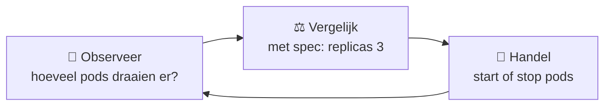

Daarom heet Kubernetes **declaratief**: je beschrijft de **gewenste toestand** (`spec`), Kubernetes houdt de **werkelijke toestand** (`status`) daarmee in lijn. Crasht er een pod, dan ziet de controller 2 in plaats van 3 en start er één bij. Niemand hoeft daar een commando voor te geven.

| Imperatief ("doe dit") | Declaratief ("zo moet het zijn") |
|---|---|
| `kubectl run`, `kubectl create`, `kubectl scale` | `kubectl apply -f bestand.yaml` |
| Snel om te testen | Herhaalbaar, staat in Git, reviewbaar |
| Cluster en je bestanden lopen uit elkaar | Bestand = de waarheid |

---

## 2. De anatomie van een manifest

Elk Kubernetes-object heeft dezelfde vier delen:

```yaml
apiVersion: apps/v1        # 1. welke versie van de API
kind: Deployment           # 2. welk soort object
metadata:                  # 3. naam, labels, namespace
  name: web
  labels:
    app: web
spec:                      # 4. de gewenste toestand (wat JIJ wil)
  replicas: 3
  ...
# status:                  # (wordt door Kubernetes ingevuld: de werkelijke toestand)
```

| `kind` | `apiVersion` | Wat is het? |
|---|---|---|
| `Pod` | `v1` | Eén of meer containers die samen draaien |
| `Deployment` | `apps/v1` | Houdt N identieke pods draaiende, regelt updates |
| `Service` | `v1` | Vast adres + load balancing naar pods |
| `ConfigMap` | `v1` | Configuratie (niet geheim) |
| `Secret` | `v1` | Gevoelige configuratie |
| `Namespace` | `v1` | Map om objecten te groeperen |
| `PersistentVolumeClaim` | `v1` | Aanvraag voor opslag |
| `Ingress` | `networking.k8s.io/v1` | HTTP-routing van buiten naar Services ([Les 8](../08-Ingress-and-Reverse-Proxies/)) |

> [!TIP]
> Twijfel je over een veld? `kubectl explain deployment.spec` of `kubectl explain pod.spec.containers` toont de documentatie in je terminal.

---

## 3. Pods

Een **pod** is de kleinste eenheid in Kubernetes: één of meer containers die samen op dezelfde node draaien, met **één IP-adres** en gedeelde opslag.

```yaml
apiVersion: v1
kind: Pod
metadata:
  name: nginx
  labels:
    app: nginx
spec:
  containers:
  - name: nginx
    image: nginx:1.27
    ports:
    - containerPort: 80
```

> [!NOTE]
> Je maakt bijna nooit zelf losse pods aan. Een losse pod die crasht of waarvan de node uitvalt, komt niet terug. Je laat pods aanmaken door een **Deployment** ([sectie 4](#4-deployments-en-replicasets)).

### Levenscyclus

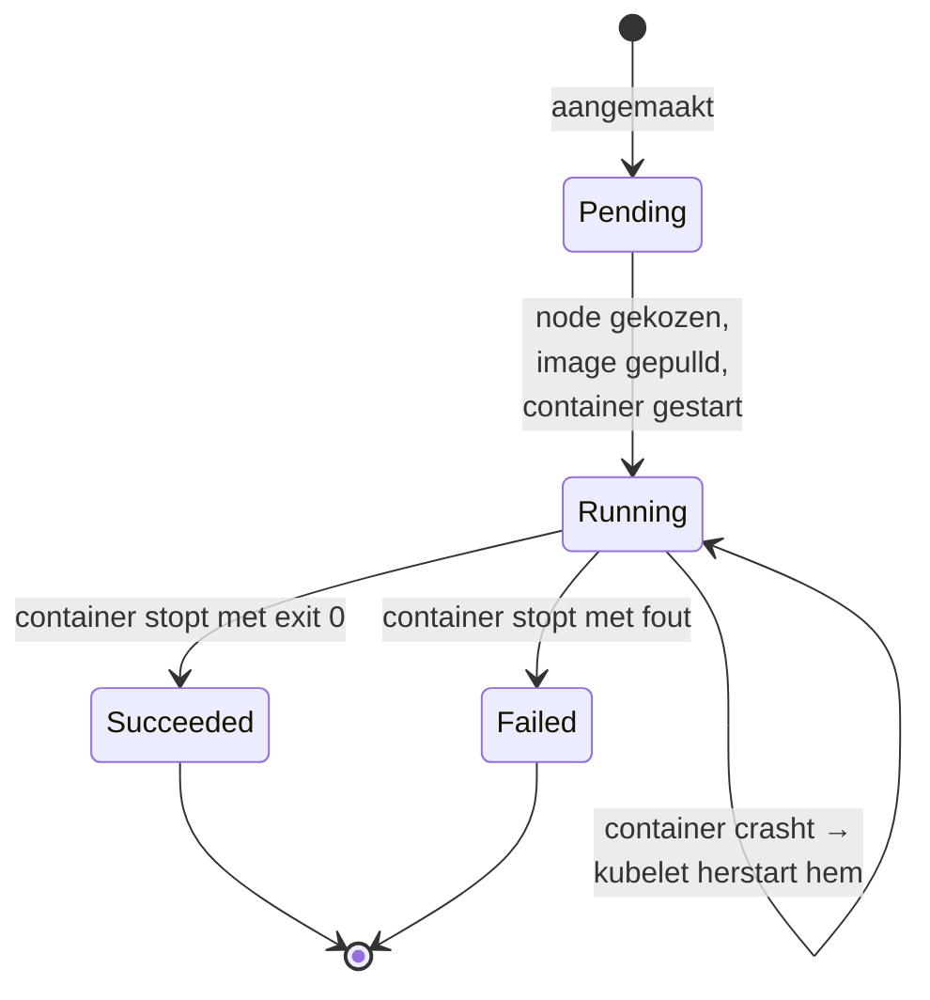

Wat je in `kubectl get pods` ziet, is vaak specifieker:

| STATUS | Betekenis |
|---|---|
| `Pending` | Wacht op een node (te weinig CPU/geheugen?) |
| `ContainerCreating` | Image wordt gepulld, volumes gekoppeld |
| `Running` | Minstens één container draait |
| `ErrImagePull` / `ImagePullBackOff` | Image kan niet gedownload worden |
| `CreateContainerConfigError` | Secret of ConfigMap ontbreekt |
| `CrashLoopBackOff` | Container crasht steeds; Kubernetes wacht telkens langer voor hij opnieuw probeert |

### Meerdere containers in één pod

Meestal één container per pod. Soms zit er een **sidecar** naast: een hulpcontainer die nauw samenwerkt met de hoofdcontainer, bv. om logs te verzamelen of verkeer te versleutelen ([service mesh](../10-Service-Mesh-and-Microservices/)).

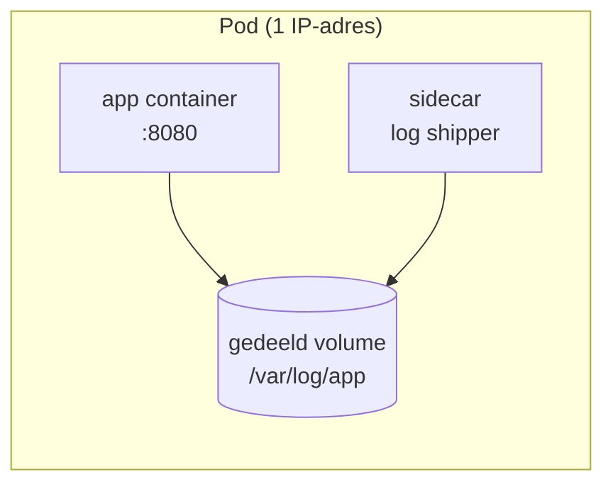

Containers in één pod delen het **netwerk** (ze bereiken elkaar via `localhost`) en kunnen **volumes** delen. Twee aparte apps, zoals een frontend en een backend, horen **niet** in één pod: die wil je los kunnen schalen en updaten.

### Resources: requests en limits

```yaml
    resources:
      requests:          # wat de scheduler reserveert
        cpu: 100m        # 0,1 CPU-kern
        memory: 128Mi
      limits:            # het maximum
        cpu: 500m
        memory: 256Mi
```

| | Betekenis | Bij overschrijden |
|---|---|---|
| `requests` | "Zoveel heb ik minstens nodig". De scheduler zoekt een node waar dit nog vrij is. | n.v.t. |
| `limits` | "Meer mag ik niet gebruiken" | CPU: container wordt afgeremd. Geheugen: container wordt gestopt (`OOMKilled`). |

### Health checks: probes

Draait een container, dan is hij nog niet altijd **gezond**. Met probes laat je Kubernetes dat controleren:

```yaml
    readinessProbe:      # mag deze pod verkeer krijgen?
      httpGet:
        path: /health
        port: 3000
      periodSeconds: 5
    livenessProbe:       # leeft deze pod nog?
      httpGet:
        path: /health
        port: 3000
      initialDelaySeconds: 15
      periodSeconds: 10
```

| Probe | Vraag | Faalt? |
|---|---|---|
| **readiness** | Is de pod klaar om verkeer te ontvangen? | Pod krijgt tijdelijk **geen verkeer** van de Service |
| **liveness** | Is de app nog in leven (niet vastgelopen)? | Container wordt **herstart** |
| **startup** | Is de (trage) app al opgestart? | Andere probes wachten tot deze slaagt |

---

## 4. Deployments en ReplicaSets

Een **Deployment** beheert een groep identieke pods. Het doet dat via een **ReplicaSet**:

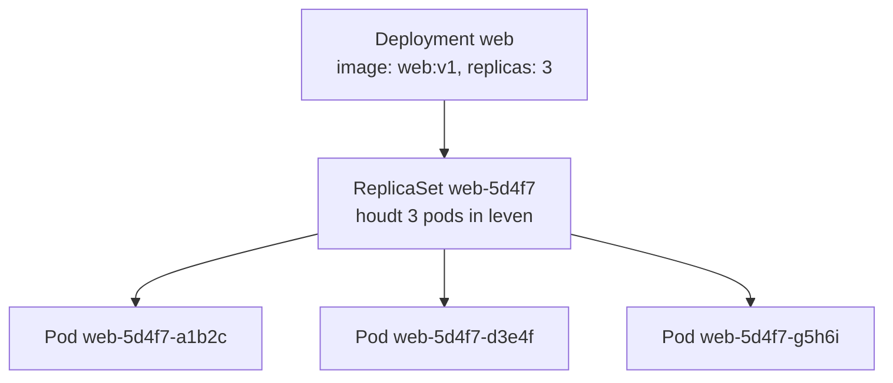

| Object | Verantwoordelijkheid |
|---|---|
| **ReplicaSet** | Zorgt dat er precies N pods zijn. Eén pod weg → één bij. |
| **Deployment** | Beheert *versies*: maakt bij elke update een nieuwe ReplicaSet en schuift de pods geleidelijk over. |

```yaml
apiVersion: apps/v1
kind: Deployment
metadata:
  name: web
spec:
  replicas: 3
  selector:
    matchLabels:
      app: web          # ← moet overeenkomen met...
  template:
    metadata:
      labels:
        app: web        # ← ...dit label van de pods
    spec:
      containers:
      - name: web
        image: nginx:1.27
```

### Rolling update

Verander je het image (`nginx:1.27` → `nginx:1.28`), dan maakt de Deployment een **nieuwe ReplicaSet** en verschuift de pods stap voor stap:

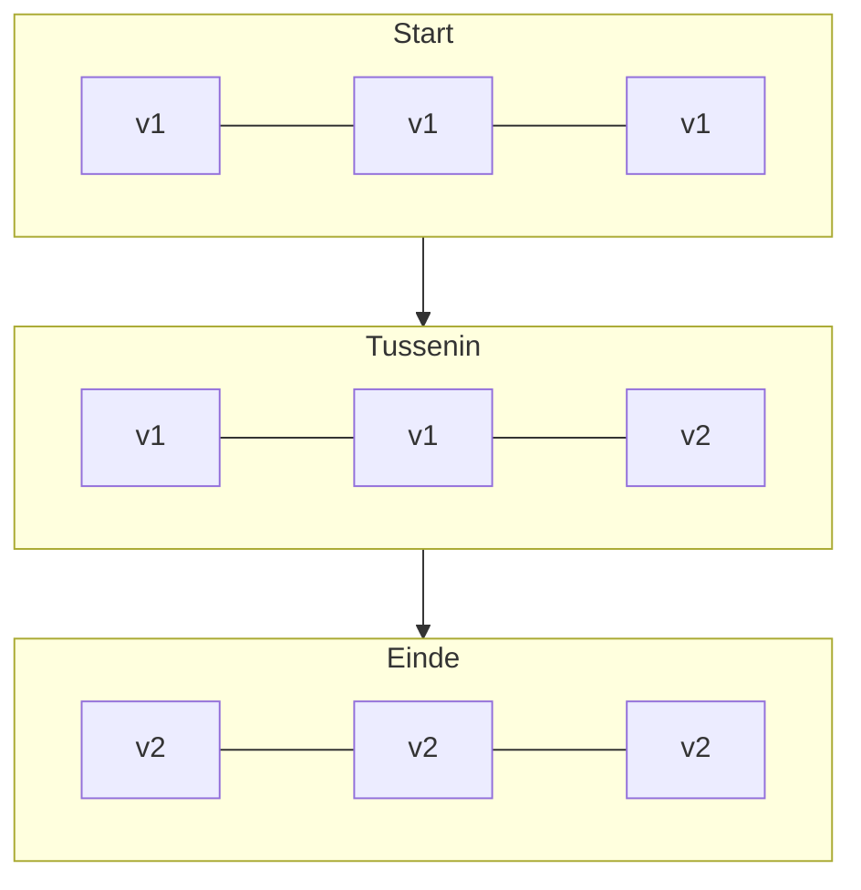

```yaml
spec:
  strategy:
    type: RollingUpdate
    rollingUpdate:
      maxSurge: 1          # max 1 pod bóven het gewenste aantal tijdens de update
      maxUnavailable: 0    # nooit minder dan 3 werkende pods
```

De oude ReplicaSet blijft bestaan met 0 pods. Daardoor kan je **terugrollen**:

```bash
kubectl rollout status deployment/web
kubectl rollout history deployment/web
kubectl rollout undo deployment/web
```

> [!TIP]
> Combineer rolling updates met een **readinessProbe**. Dan krijgt een nieuwe pod pas verkeer als hij écht klaar is, en stopt de update vanzelf als de nieuwe versie niet gezond wordt.

---

## 5. Services en DNS

### Het probleem: pods zijn vluchtig

Pods komen en gaan, en elke nieuwe pod krijgt een **nieuw IP-adres**. Een frontend kan dus niet hardcoderen "de backend zit op 10.244.1.7".

### De oplossing: een Service

Een **Service** is een vast aanspreekpunt (naam + virtueel IP) dat verkeer verdeelt over alle pods met een bepaald label:

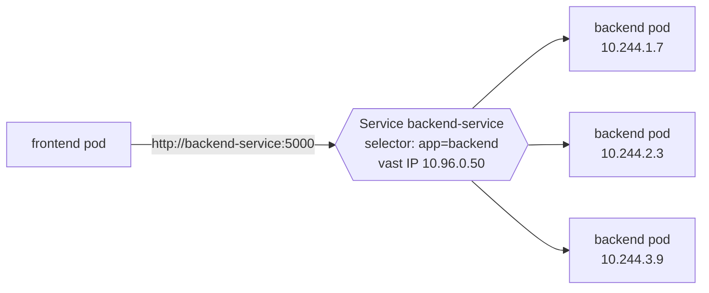

```yaml
apiVersion: v1
kind: Service
metadata:
  name: backend-service
spec:
  selector:
    app: backend         # verkeer naar alle pods met dit label
  ports:
  - port: 5000           # poort van de Service
    targetPort: 5000     # poort in de container
```

Welke pods een Service op dit moment bedient, zie je met `kubectl get endpoints backend-service`.

### Service types

Elk type bouwt verder op het vorige:

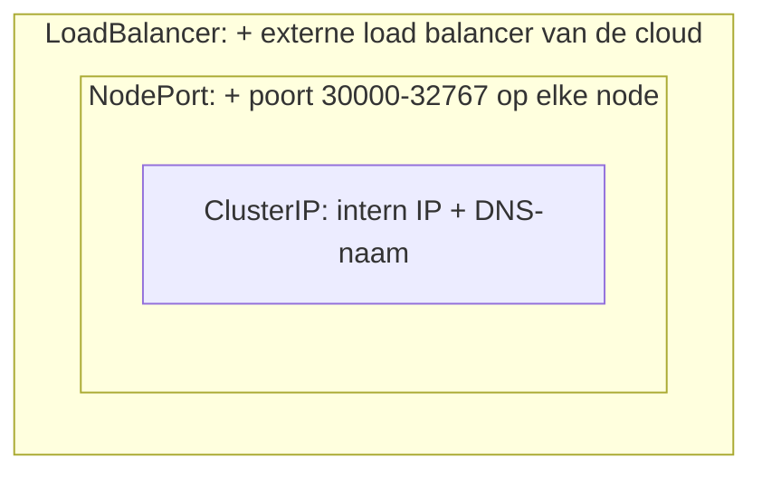

| Type | Bereikbaar van | Gebruik |
|---|---|---|
| `ClusterIP` (standaard) | Enkel binnen de cluster | Databases, interne API's |
| `NodePort` | `<node-IP>:<30000-32767>` | Testen, Minikube |
| `LoadBalancer` | Publiek IP (cloud) | Een app op internet zetten ([Les 6a](kubernetes-cloud-start.md)) |
| Headless (`clusterIP: None`) | DNS geeft de IP's van de pods zelf terug | StatefulSets, databases met replicatie |

### DNS: Services vinden via hun naam

Kubernetes heeft een ingebouwde DNS-server (**CoreDNS**). Elke Service krijgt automatisch een naam:

```
<service>.<namespace>.svc.cluster.local
backend-service.default.svc.cluster.local
```

| Je zit in... | Je schrijft |
|---|---|
| Dezelfde namespace | `http://backend-service:5000` |
| Een andere namespace | `http://backend-service.shop:5000` |

```bash
kubectl exec -it deploy/frontend -- nslookup backend-service
```

---

## 6. ConfigMaps en Secrets

Bouw configuratie **niet in je image**. Dan kan je hetzelfde image gebruiken in test en productie, met andere instellingen.

| | ConfigMap | Secret |
|---|---|---|
| Voor | Instellingen: URL's, poorten, log level | Wachtwoorden, tokens, API keys, certificaten |
| Opslag in YAML | Leesbare tekst (`data:`) | base64 (`data:`) of tekst (`stringData:`) |
| Beveiliging | Geen | Apart beheerd, toegang beperkbaar met RBAC, optioneel versleuteld in etcd |

```yaml
apiVersion: v1
kind: ConfigMap
metadata:
  name: app-config
data:
  LOG_LEVEL: info
  DATABASE_HOST: mongodb-service
---
apiVersion: v1
kind: Secret
metadata:
  name: app-secret
type: Opaque
stringData:                   # gewone tekst; Kubernetes zet het zelf om naar base64
  DATABASE_PASSWORD: s3cret
```

> [!CAUTION]
> **base64 is geen encryptie.** `echo czNjcmV0 | base64 -d` geeft gewoon `s3cret`. Zet echte Secrets **niet in Git**. Maak ze met `kubectl create secret generic ... --from-literal=...`, of gebruik een secret manager (Les 11).

### Drie manieren om ze te gebruiken

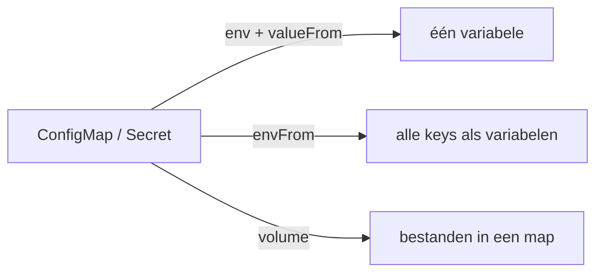

```yaml
    containers:
    - name: app
      image: myapp:1.0
      env:
      - name: DB_PASSWORD               # 1. één key, eigen naam
        valueFrom:
          secretKeyRef:
            name: app-secret
            key: DATABASE_PASSWORD
      envFrom:
      - configMapRef:                   # 2. alle keys als env-variabelen
          name: app-config
      volumeMounts:
      - name: config
        mountPath: /etc/app             # 3. elke key wordt een bestand
    volumes:
    - name: config
      configMap:
        name: app-config
```

> [!NOTE]
> **Wijzig je een ConfigMap of Secret, dan zien draaiende pods dat niet** als het om env-variabelen gaat: die worden enkel bij het starten ingelezen. Herstart de pods met `kubectl rollout restart deployment/<naam>`. Als volume gekoppelde bestanden worden na ongeveer een minuut wél bijgewerkt.

---

## 7. Labels en selectors

**Labels** zijn sleutel-waarde-paren op objecten. **Selectors** zoeken objecten op label. Zo hangen Deployments, pods en Services aan elkaar, zonder naar namen of IP's te verwijzen.

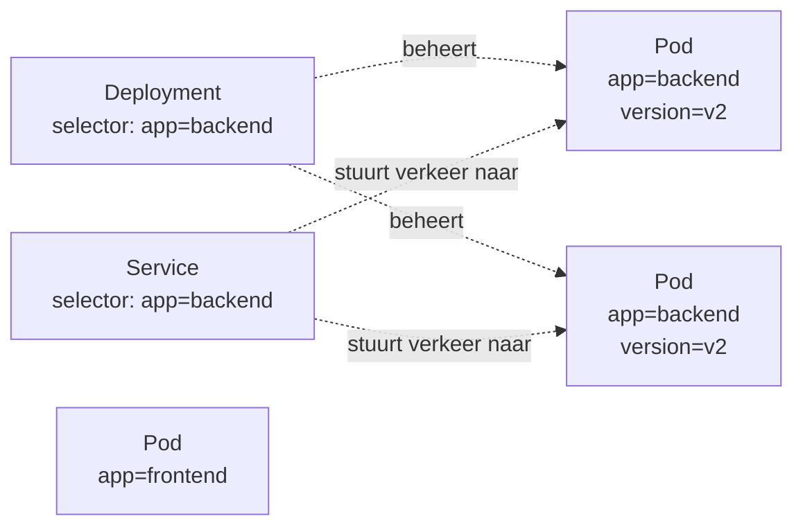

De Service vindt **elke** pod met `app=backend`, ook pods die later bijkomen. Daardoor werkt schalen vanzelf.

```bash
kubectl get pods --show-labels
kubectl get pods -l app=backend                      # gelijk aan
kubectl get pods -l app=backend,version=v2           # EN
kubectl get pods -l 'app in (frontend,backend)'      # één van
kubectl get pods -l 'app!=mongodb'                   # niet gelijk aan
kubectl label pod <pod> env=test                     # label toevoegen
kubectl label pod <pod> env-                         # label verwijderen
```

> [!WARNING]
> De klassieke fout: de `selector` van een Service of Deployment komt niet overeen met de `labels` in de pod-template. Gevolg: een Service zonder endpoints, of een Deployment die niet aangemaakt wordt (`selector does not match template labels`).

Aanbevolen labels als je project groeit:

```yaml
metadata:
  labels:
    app.kubernetes.io/name: backend
    app.kubernetes.io/part-of: petshelter
    app.kubernetes.io/version: "1.2.0"
    app.kubernetes.io/managed-by: helm     # zie Les 7
```

---

## 8. Namespaces

Een **namespace** is een map binnen de cluster. Namen moeten uniek zijn *binnen* een namespace, niet erbuiten.

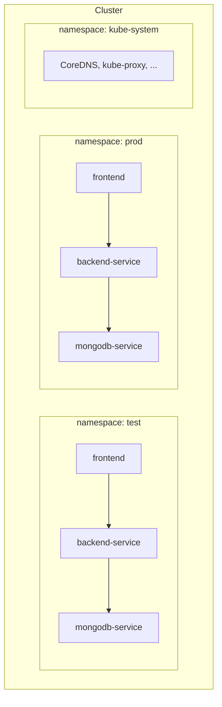

| Namespace | Inhoud |
|---|---|
| `default` | Waar je objecten terechtkomen als je niets opgeeft |
| `kube-system` | Onderdelen van Kubernetes zelf |
| `kube-public`, `kube-node-lease` | Intern gebruik |

```bash
kubectl create namespace test
kubectl apply -f k8s/ -n test
kubectl get pods -n test
kubectl get pods -A                                  # alle namespaces
kubectl config set-context --current --namespace=test   # standaard namespace wijzigen
kubectl delete namespace test                        # verwijdert ALLES erin
```

Typisch gebruik: **omgevingen** (test/prod, zie de Final Assessment), **teams**, of **projecten**. Met een **ResourceQuota** begrens je wat een namespace mag gebruiken:

```yaml
apiVersion: v1
kind: ResourceQuota
metadata:
  name: test-quota
  namespace: test
spec:
  hard:
    pods: "10"
    requests.cpu: "2"
    requests.memory: 4Gi
```

> [!NOTE]
> Namespaces scheiden **namen**, niet het **netwerk**. Een pod in `test` kan standaard gewoon `backend-service.prod` bereiken. Netwerkverkeer afschermen doe je met **NetworkPolicies** (Les 11).

---

## 9. Opslag: volumes en PersistentVolumeClaims

Bestanden in een container verdwijnen als de container verdwijnt. Voor een database is dat een probleem.

| Volume-type | Leeft zo lang als | Gebruik |
|---|---|---|
| `emptyDir` | De pod | Tijdelijke bestanden, delen tussen containers in één pod |
| `configMap` / `secret` | Het object | Configuratiebestanden |
| `persistentVolumeClaim` | Tot je de claim verwijdert | Databases, uploads: alles wat moet blijven |

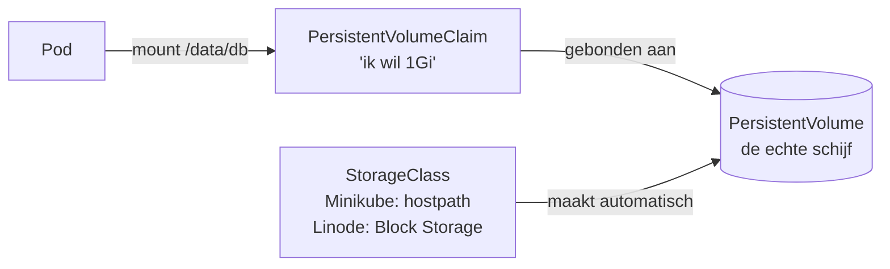

- Je **pod** vraagt opslag aan via een **PVC** ("ik wil 1 GB").
- Een **StorageClass** maakt automatisch een passende **PersistentVolume** (PV) aan: in Minikube een map op de node, bij Linode een Block Storage Volume.
- De PVC blijft bestaan als de pod verdwijnt. Een nieuwe pod koppelt dezelfde data.

```yaml
apiVersion: v1
kind: PersistentVolumeClaim
metadata:
  name: mongodb-pvc
spec:
  accessModes: [ReadWriteOnce]    # door één node tegelijk te koppelen
  resources:
    requests:
      storage: 1Gi
```

Uitgewerkt voorbeeld met MongoDB: [Les 6c, sectie 10.3](kubernetes-minikube.md#103-data-bewaren-met-een-persistentvolumeclaim).

> [!NOTE]
> Voor databases met **meerdere replicas** gebruik je een **StatefulSet** in plaats van een Deployment: elke pod krijgt dan een vaste naam (`mongodb-0`, `mongodb-1`) en een eigen PVC.

---

## 10. Alles samen: een 3-tier applicatie

Zo ziet de Pet Shelter-applicatie uit [Les 6c](kubernetes-minikube.md) eruit in Kubernetes-objecten:

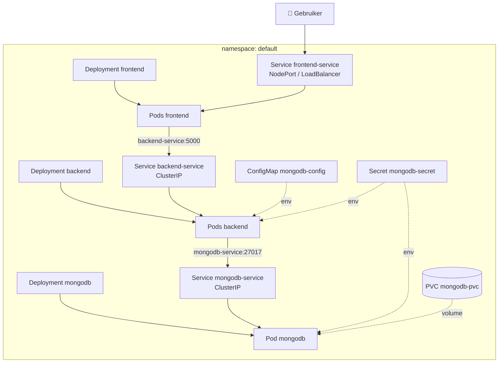

| Tier | Objecten | Waarom |
|---|---|---|
| **Frontend** | Deployment + Service (`NodePort`/`LoadBalancer`) | De enige toegang van buitenaf, schaalbaar |
| **Backend** | Deployment + Service (`ClusterIP`) | Enkel bereikbaar voor de frontend, schaalbaar |
| **Database** | Deployment (1 replica) + Service (`ClusterIP`) + PVC | Niet van buiten bereikbaar, data blijft bewaard |
| **Config** | ConfigMap + Secret | Zelfde images in elke omgeving |

Het patroon is altijd hetzelfde: **Deployment** (wat draait er?) + **Service** (hoe bereik je het?) + **ConfigMap/Secret** (met welke instellingen?) + eventueel **PVC** (welke data blijft?).

---

## 11. Samenvatting

| Begrip | In één zin |
|---|---|
| **Desired state** | Jij beschrijft `spec`, controllers zorgen dat `status` volgt |
| **Pod** | Eén of meer containers met één IP; vluchtig |
| **Deployment** | Houdt N pods draaiende, regelt rolling updates en rollback via ReplicaSets |
| **Service** | Vaste naam + IP, load balancing naar pods met een label |
| **DNS** | `<service>.<namespace>`: services vinden zonder IP's |
| **ConfigMap / Secret** | Configuratie buiten het image; Secrets zijn base64, niet versleuteld |
| **Labels & selectors** | De lijm tussen Deployments, pods en Services |
| **Namespace** | Map in de cluster voor omgevingen, teams of projecten |
| **PVC** | Opslag die een pod overleeft |
| **Probes** | readiness = verkeer ja/nee, liveness = herstarten ja/nee |
| **requests / limits** | Wat de scheduler reserveert / het maximum |

### Best practices

- ✅ Werk **declaratief**: manifests in Git, `kubectl apply -f`.
- ✅ Gebruik **versietags** voor images, nooit `latest` in productie.
- ✅ Zet **requests en limits** op elke container.
- ✅ Voeg een **readinessProbe** toe aan alles wat verkeer ontvangt.
- ✅ Configuratie in **ConfigMaps**, wachtwoorden in **Secrets**, en Secrets niet in Git.
- ✅ Alleen wat publiek moet zijn krijgt `NodePort`/`LoadBalancer`; de rest blijft `ClusterIP`.
- ✅ **Consistente labels** op alles.

### Volgende stap

In **[Les 6c – Kubernetes met Minikube](kubernetes-minikube.md)** deploy je de 3-tier Pet Shelter-applicatie zelf, met Secrets, ConfigMaps, Services en debugging.
